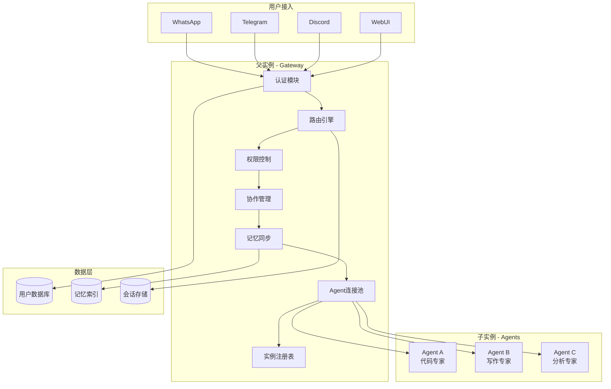
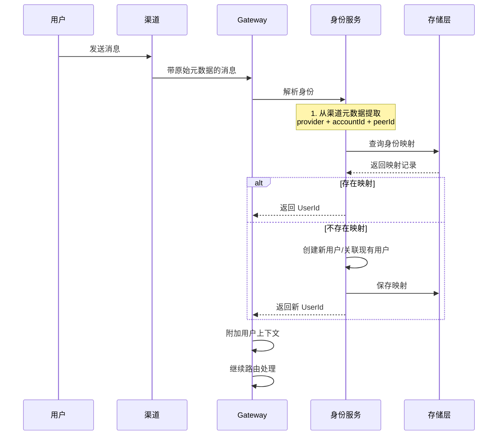
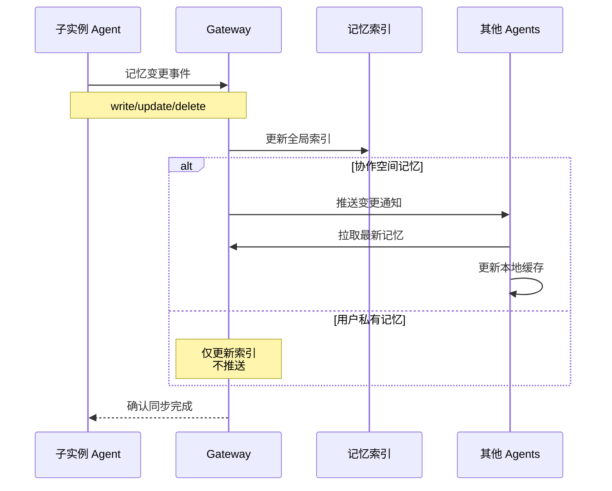
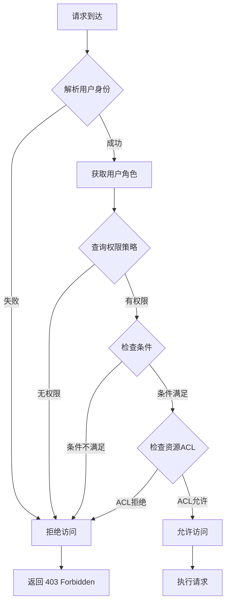
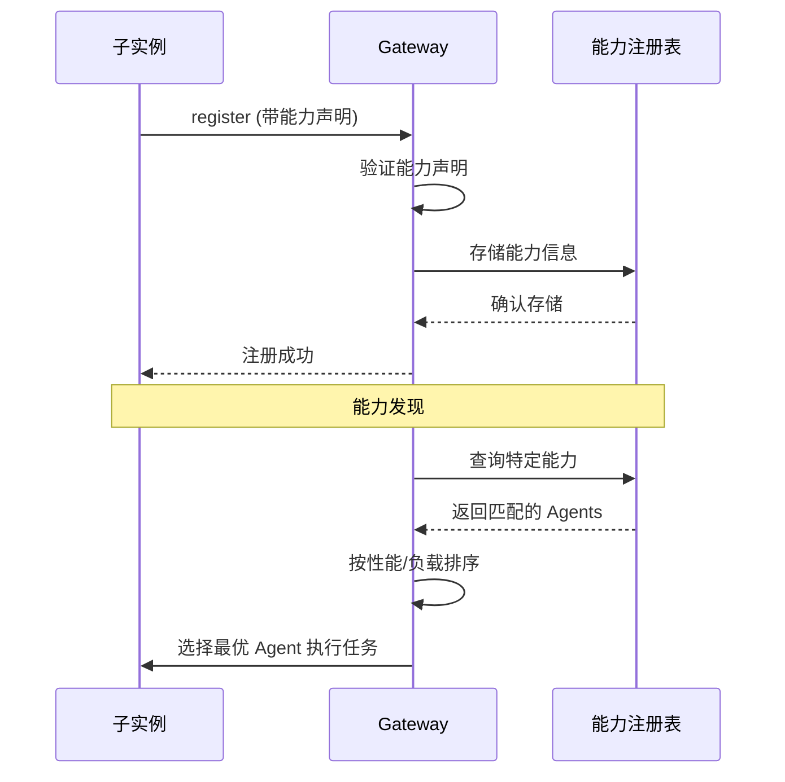
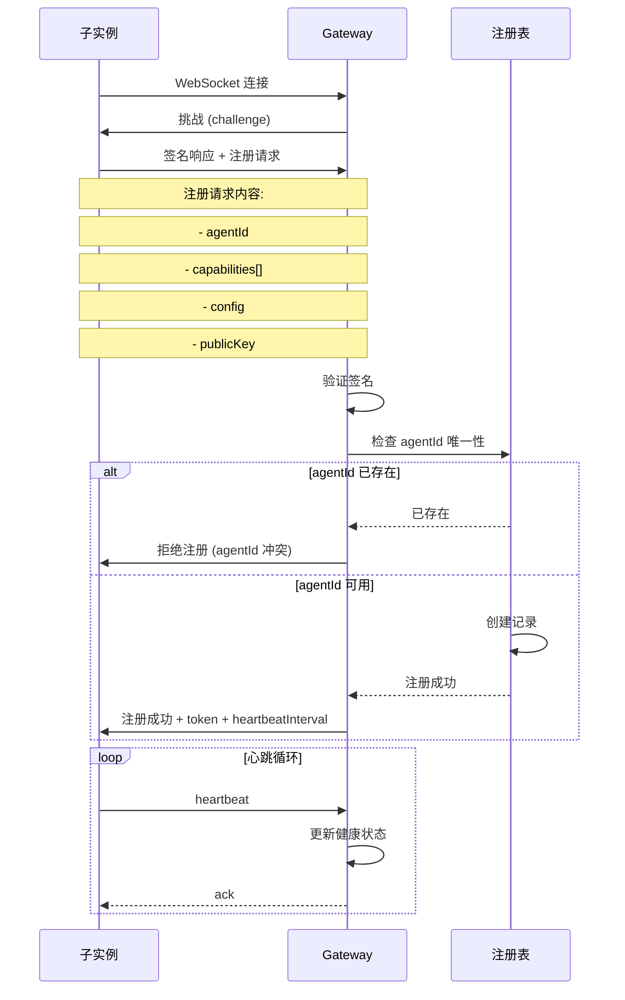
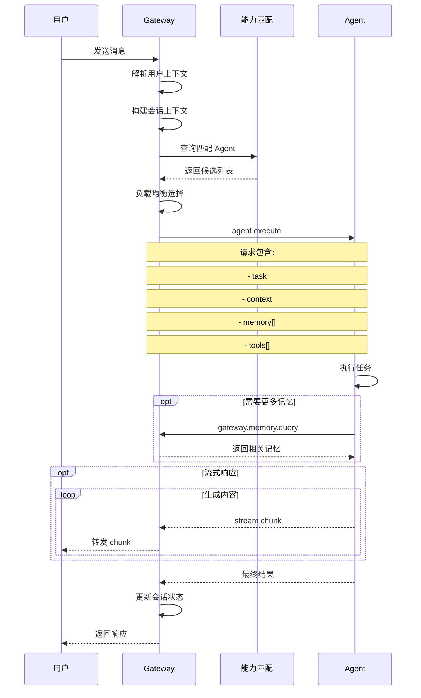

# OpenClaw 多用户父子实例架构设计

**版本**: 1.0.0  
**日期**: 2026-02-21  
**状态**: 设计草案

---

## 目录

1. [系统架构概述](#1-系统架构概述)
2. [多用户协作设计](#2-多用户协作设计)
3. [父子实例通信](#3-父子实例通信)
4. [数据模型](#4-数据模型)
5. [API 设计](#5-api-设计)
6. [安全设计](#6-安全设计)
7. [实现路线图](#7-实现路线图)

---

## 1. 系统架构概述

### 1.1 整体架构图

```
┌─────────────────────────────────────────────────────────────────────────────┐
│                              用户层 (User Layer)                             │
│  ┌─────────┐  ┌─────────┐  ┌─────────┐  ┌─────────┐  ┌─────────┐           │
│  │WhatsApp │  │Telegram │  │ Discord │  │  WebUI  │  │   CLI   │           │
│  └────┬────┘  └────┬────┘  └────┬────┘  └────┬────┘  └────┬────┘           │
└───────┼────────────┼────────────┼────────────┼────────────┼─────────────────┘
        │            │            │            │            │
        └────────────┴─────┬──────┴────────────┴────────────┘
                           │
                           ▼
┌─────────────────────────────────────────────────────────────────────────────┐
│                        父实例 - Gateway (Parent Instance)                     │
│  ┌───────────────────────────────────────────────────────────────────────┐  │
│  │                         路由层 (Router Layer)                          │  │
│  │  ┌─────────────┐  ┌─────────────┐  ┌─────────────┐  ┌─────────────┐   │  │
│  │  │ 用户识别    │  │ 会话路由    │  │ 负载均衡    │  │ 能力发现    │   │  │
│  │  │ Identity    │  │ Session     │  │ LoadBalance │  │ Capability  │   │  │
│  │  └─────────────┘  └─────────────┘  └─────────────┘  └─────────────┘   │  │
│  └───────────────────────────────────────────────────────────────────────┘  │
│  ┌───────────────────────────────────────────────────────────────────────┐  │
│  │                         协作层 (Collaboration Layer)                   │  │
│  │  ┌─────────────┐  ┌─────────────┐  ┌─────────────┐  ┌─────────────┐   │  │
│  │  │ 用户管理    │  │ 权限控制    │  │ 协作空间    │  │ 记忆同步    │   │  │
│  │  │ UserManager │  │ AccessCtrl  │  │ Workspace   │  │ MemSync     │   │  │
│  │  └─────────────┘  └─────────────┘  └─────────────┘  └─────────────┘   │  │
│  └───────────────────────────────────────────────────────────────────────┘  │
│  ┌───────────────────────────────────────────────────────────────────────┐  │
│  │                         连接层 (Connection Layer)                      │  │
│  │  ┌─────────────┐  ┌─────────────┐  ┌─────────────┐  ┌─────────────┐   │  │
│  │  │ Agent池管理 │  │ 健康检查    │  │ 故障转移    │  │ 连接池      │   │  │
│  │  │ AgentPool   │  │ HealthCheck │  │ Failover    │  │ ConnPool    │   │  │
│  │  └─────────────┘  └─────────────┘  └─────────────┘  └─────────────┘   │  │
│  └───────────────────────────────────────────────────────────────────────┘  │
│  ┌───────────────────────────────────────────────────────────────────────┐  │
│  │                         数据层 (Data Layer)                            │  │
│  │  ┌─────────────┐  ┌─────────────┐  ┌─────────────┐  ┌─────────────┐   │  │
│  │  │ 用户存储    │  │ 会话存储    │  │ 记忆索引    │  │ 实例注册表  │   │  │
│  │  │ UserStore   │  │ SessionStore│  │ MemIndex    │  │ Registry    │   │  │
│  │  └─────────────┘  └─────────────┘  └─────────────┘  └─────────────┘   │  │
│  └───────────────────────────────────────────────────────────────────────┘  │
└─────────────────────────────────────────────────────────────────────────────┘
                           │
         ┌─────────────────┼─────────────────┬─────────────────┐
         │                 │                 │                 │
         ▼                 ▼                 ▼                 ▼
┌─────────────┐    ┌─────────────┐    ┌─────────────┐    ┌─────────────┐
│ 子实例 A    │    │ 子实例 B    │    │ 子实例 C    │    │ 子实例 D    │
│ (Agent A)   │    │ (Agent B)   │    │ (Agent C)   │    │ (Agent D)   │
│ ┌─────────┐ │    │ ┌─────────┐ │    │ ┌─────────┐ │    │ ┌─────────┐ │
│ │LLM Brain│ │    │ │LLM Brain│ │    │ │LLM Brain│ │    │ │LLM Brain│ │
│ │Memory   │ │    │ │Memory   │ │    │ │Memory   │ │    │ │Memory   │ │
│ │Tools    │ │    │ │Tools    │ │    │ │Tools    │ │    │ │Tools    │ │
│ │Skills   │ │    │ │Skills   │ │    │ │Skills   │ │    │ │Skills   │ │
│ └─────────┘ │    │ └─────────┘ │    │ └─────────┘ │    │ └─────────┘ │
│ 能力: 代码   │    │ 能力: 写作   │    │ 能力: 分析   │    │ 能力: 翻译   │
│ 位置: 本地   │    │ 位置: 远程   │    │ 位置: 云端   │    │ 位置: 边缘   │
└─────────────┘    └─────────────┘    └─────────────┘    └─────────────┘
```

### 1.2 组件关系图 (Mermaid)



### 1.3 父实例（Gateway）职责

| 职责领域 | 具体功能 | 说明 |
|---------|---------|------|
| **用户管理** | 身份识别、认证授权、用户档案 | 统一管理所有用户的身份和权限 |
| **会话路由** | 消息分发、会话映射、负载均衡 | 将用户请求路由到合适的子实例 |
| **协作控制** | 协作空间管理、共享权限、实时同步 | 支持多用户协作场景 |
| **记忆协调** | 记忆索引、跨实例同步、访问控制 | 协调全局和私有记忆的访问 |
| **连接管理** | Agent 注册、健康检查、故障转移 | 管理所有子实例的连接 |
| **数据持久化** | 用户数据、会话历史、系统状态 | 集中存储关键数据 |

### 1.4 子实例（Agent）职责

| 职责领域 | 具体功能 | 说明 |
|---------|---------|------|
| **LLM 推理** | 模型加载、推理执行、流式输出 | 核心 AI 能力 |
| **记忆管理** | 本地记忆、上下文构建、记忆检索 | 管理实例级记忆 |
| **工具执行** | 工具调用、沙箱隔离、结果返回 | 执行具体工具操作 |
| **技能运行** | Skill 加载、技能执行、状态管理 | 运行特定领域技能 |
| **能力声明** | 能力注册、状态上报、心跳响应 | 向父实例声明自身能力 |
| **任务执行** | 任务接收、执行反馈、结果提交 | 执行分配的具体任务 |

### 1.5 设计原则

1. **渐进式隔离**: 记忆按需隔离，支持从完全共享到完全私有的连续谱
2. **弹性扩展**: 子实例可动态增减，支持热插拔
3. **能力驱动**: 基于能力发现进行智能路由，而非硬编码
4. **协作优先**: 设计上支持多用户协作，而非事后补丁
5. **故障容错**: 单点故障不影响整体系统可用性

---

## 2. 多用户协作设计

### 2.1 用户身份识别方案

#### 2.1.1 身份模型

```
┌─────────────────────────────────────────────────────────────┐
│                      Identity Model                          │
├─────────────────────────────────────────────────────────────┤
│                                                              │
│  ┌─────────────┐         ┌─────────────┐                   │
│  │   UserId    │─────────│   Profile   │                   │
│  │  (UUID)     │         │  - Name     │                   │
│  │             │         │  - Email    │                   │
│  │             │         │  - TimeZone │                   │
│  │             │         │  - Locale   │                   │
│  └─────────────┘         └─────────────┘                   │
│        │                                                     │
│        │ has_many                                            │
│        ▼                                                     │
│  ┌─────────────┐         ┌─────────────┐                   │
│  │ ChannelId   │─────────│ TrustLevel  │                   │
│  │ - Provider  │         │ - guest     │                   │
│  │ - AccountId │         │ - member    │                   │
│  │ - PeerId    │         │ - admin     │                   │
│  └─────────────┘         │ - owner     │                   │
│                          └─────────────┘                   │
│                                                              │
└─────────────────────────────────────────────────────────────┘
```

#### 2.1.2 身份解析流程



#### 2.1.3 渠道身份映射配置

```json5
{
  identity: {
    // 身份解析策略
    resolution: {
      // 同一用户跨渠道识别
      crossChannel: {
        enabled: true,
        // 通过邮箱/手机号关联
        linkBy: ["email", "phone"],
        // 自动关联阈值
        autoLinkThreshold: "high" // high | medium | low | manual
      },
      // 身份链接规则（扩展现有 session.identityLinks）
      identityLinks: {
        "user:alice": [
          "telegram:123456789",
          "discord:987654321012345678",
          "whatsapp:+15551234567"
        ]
      }
    },
    
    // 新用户自动创建
    autoCreate: {
      enabled: true,
      defaultRole: "member",
      requireApproval: false
    }
  }
}
```

### 2.2 记忆层级设计

#### 2.2.1 记忆层级架构

```
┌────────────────────────────────────────────────────────────────────────┐
│                         Memory Hierarchy                                │
├────────────────────────────────────────────────────────────────────────┤
│                                                                         │
│  Level 0: 全局共享记忆 (Global Memory)                                  │
│  ┌─────────────────────────────────────────────────────────────────┐  │
│  │  - 系统知识                                                      │  │
│  │  - 通用技能                                                      │  │
│  │  - 团队规范                                                      │  │
│  │  访问: 所有用户只读，管理员可写                                  │  │
│  └─────────────────────────────────────────────────────────────────┘  │
│                              ▲                                          │
│                              │ inherits                                 │
│                              │                                          │
│  Level 1: 协作空间记忆 (Workspace Memory)                              │
│  ┌─────────────────────────────────────────────────────────────────┐  │
│  │  - 项目知识                                                      │  │
│  │  - 团队决策                                                      │  │
│  │  - 共享上下文                                                    │  │
│  │  访问: 空间成员可读写                                            │  │
│  └─────────────────────────────────────────────────────────────────┘  │
│                              ▲                                          │
│                              │ inherits                                 │
│                              │                                          │
│  Level 2: 用户私有记忆 (User Private Memory)                           │
│  ┌─────────────────────────────────────────────────────────────────┐  │
│  │  - 个人偏好                                                      │  │
│  │  - 私密对话                                                      │  │
│  │  - 敏感信息                                                      │  │
│  │  访问: 仅用户本人                                                │  │
│  └─────────────────────────────────────────────────────────────────┘  │
│                              ▲                                          │
│                              │ inherits                                 │
│                              │                                          │
│  Level 3: 会话记忆 (Session Memory)                                    │
│  ┌─────────────────────────────────────────────────────────────────┐  │
│  │  - 当前对话上下文                                                │  │
│  │  - 临时状态                                                      │  │
│  │  访问: 当前会话参与者                                            │  │
│  └─────────────────────────────────────────────────────────────────┘  │
│                                                                         │
└────────────────────────────────────────────────────────────────────────┘
```

#### 2.2.2 记忆存储结构

```typescript
// 记忆条目结构
interface MemoryEntry {
  id: string;                    // 记忆ID
  level: 'global' | 'workspace' | 'user' | 'session';
  
  // 所有权
  ownerId: string;               // 拥有者ID (userId / workspaceId / 'global')
  creatorId: string;             // 创建者ID
  
  // 内容
  content: string;               // 记忆内容 (Markdown)
  summary?: string;              // 摘要
  embedding?: number[];          // 向量嵌入
  
  // 元数据
  metadata: {
    channel?: string;            // 来源渠道
    sessionId?: string;          // 关联会话
    tags: string[];              // 标签
    importance: number;          // 重要性 0-1
    sensitivity: 'public' | 'internal' | 'confidential' | 'secret';
  };
  
  // 访问控制
  access: {
    read: AccessRule[];          // 读权限
    write: AccessRule[];         // 写权限
  };
  
  // 时间戳
  createdAt: Date;
  updatedAt: Date;
  expiresAt?: Date;              // 过期时间
}

// 访问规则
interface AccessRule {
  type: 'user' | 'role' | 'workspace' | 'all';
  id: string;                    // 对应ID
  permissions: ('read' | 'write' | 'admin')[];
}
```

#### 2.2.3 记忆检索策略

```typescript
interface MemoryQuery {
  userId: string;                // 查询用户
  workspaceId?: string;          // 当前协作空间
  sessionId?: string;            // 当前会话
  
  query: string;                 // 查询文本
  embedding?: number[];          // 查询向量
  
  // 检索范围
  scope: {
    global: boolean;             // 包含全局记忆
    workspace: boolean;          // 包含空间记忆
    user: boolean;               // 包含用户记忆
    session: boolean;            // 包含会话记忆
  };
  
  // 过滤条件
  filters?: {
    tags?: string[];
    importanceMin?: number;
    sensitivityMax?: 'public' | 'internal' | 'confidential' | 'secret';
    timeRange?: { start: Date; end: Date };
  };
  
  // 结果配置
  limit: number;
  includeContent: boolean;       // 是否包含完整内容
  deduplicate: boolean;          // 去重
}

interface MemorySearchResult {
  entries: {
    entry: MemoryEntry;
    score: number;               // 相关性分数
    source: string;              // 来源层级
    accessLevel: 'full' | 'partial' | 'metadata'; // 访问级别
  }[];
  
  // 权限过滤统计
  filtered: {
    noAccess: number;
    sensitivityFiltered: number;
  };
}
```

#### 2.2.4 记忆同步机制



### 2.3 权限模型

#### 2.3.1 RBAC + ABAC 混合模型

```
┌────────────────────────────────────────────────────────────────────────┐
│                      Permission Model                                   │
├────────────────────────────────────────────────────────────────────────┤
│                                                                         │
│  Role-Based (RBAC)              Attribute-Based (ABAC)                 │
│  ┌─────────────────────┐       ┌─────────────────────┐                │
│  │ Roles:              │       │ Attributes:          │                │
│  │ - owner             │       │ - time              │                │
│  │ - admin             │       │ - location          │                │
│  │ - member            │       │ - device            │                │
│  │ - guest             │       │ - trustLevel        │                │
│  │ - agent             │       │ - sessionType       │                │
│  └─────────────────────┘       └─────────────────────┘                │
│           │                              │                             │
│           └──────────┬───────────────────┘                             │
│                      │                                                   │
│                      ▼                                                   │
│            ┌─────────────────────┐                                      │
│            │   Policy Engine     │                                      │
│            │   (策略引擎)         │                                      │
│            └─────────────────────┘                                      │
│                      │                                                   │
│                      ▼                                                   │
│  ┌─────────────────────────────────────────────────────────────────┐  │
│  │                      Permission Check                            │  │
│  │                                                                   │  │
│  │  ALLOW if:                                                        │  │
│  │    (role IN allowedRoles) AND (attributes satisfy conditions)    │  │
│  │                                                                   │  │
│  └─────────────────────────────────────────────────────────────────┘  │
│                                                                         │
└────────────────────────────────────────────────────────────────────────┘
```

#### 2.3.2 权限定义

```typescript
// 权限定义
interface Permission {
  resource: string;              // 资源类型
  action: string;                // 操作类型
  conditions?: Condition[];      // 条件约束
}

// 资源类型
type ResourceType = 
  | 'memory'           // 记忆资源
  | 'session'          // 会话资源
  | 'workspace'        // 协作空间
  | 'agent'            // Agent 实例
  | 'tool'             // 工具调用
  | 'config'           // 配置管理
  ;

// 操作类型
type ActionType =
  | 'create'           // 创建
  | 'read'             // 读取
  | 'update'           // 更新
  | 'delete'           // 删除
  | 'share'            // 分享
  | 'admin'            // 管理
  ;

// 条件约束
interface Condition {
  type: 'time' | 'location' | 'device' | 'trust' | 'custom';
  operator: 'eq' | 'ne' | 'gt' | 'lt' | 'in' | 'contains';
  value: any;
}

// 角色-权限映射
const rolePermissions: Record<Role, Permission[]> = {
  owner: [
    { resource: '*', action: '*' },  // 完全权限
  ],
  admin: [
    { resource: 'memory', action: '*' },
    { resource: 'session', action: '*' },
    { resource: 'workspace', action: '*' },
    { resource: 'agent', action: 'read' },
    { resource: 'config', action: 'read' },
  ],
  member: [
    { resource: 'memory', action: 'create' },
    { resource: 'memory', action: 'read', conditions: [
      { type: 'custom', operator: 'eq', value: 'hasAccess' }
    ]},
    { resource: 'memory', action: 'update', conditions: [
      { type: 'custom', operator: 'eq', value: 'isOwner' }
    ]},
    { resource: 'workspace', action: 'read' },
    { resource: 'tool', action: '*', conditions: [
      { type: 'trust', operator: 'gte', value: 'member' }
    ]},
  ],
  guest: [
    { resource: 'memory', action: 'read', conditions: [
      { type: 'custom', operator: 'eq', value: 'isPublic' }
    ]},
    { resource: 'workspace', action: 'read', conditions: [
      { type: 'custom', operator: 'eq', value: 'isPublic' }
    ]},
  ],
  agent: [
    { resource: 'memory', action: 'read', conditions: [
      { type: 'custom', operator: 'eq', value: 'inScope' }
    ]},
    { resource: 'tool', action: '*' },
  ],
};
```

#### 2.3.3 访问控制流程



### 2.4 会话管理

#### 2.4.1 会话类型与隔离

```typescript
// 会话类型
type SessionType = 
  | 'direct'           // 私聊会话
  | 'group'            // 群组会话
  | 'workspace'        // 协作空间会话
  | 'isolated'         // 隔离任务会话
  ;

// 会话配置
interface SessionConfig {
  // DM 隔离策略（扩展现有 dmScope）
  dmScope: 'main' | 'per-peer' | 'per-channel-peer' | 'per-account-channel-peer' | 'per-workspace';
  
  // 协作空间会话策略
  workspaceSession: {
    // 空间内会话共享
    shareWithinWorkspace: boolean;
    // 跨空间可见性
    crossWorkspaceVisibility: 'none' | 'readonly' | 'full';
  };
  
  // 会话继承
  sessionInheritance: {
    enabled: boolean;
    // 从父会话继承上下文
    maxParentDepth: number;
    // 继承的记忆层级
    inheritLevels: ('global' | 'workspace' | 'user')[];
  };
}

// 会话键结构（扩展）
interface SessionKey {
  agentId: string;
  type: SessionType;
  identifiers: {
    channel?: string;
    accountId?: string;
    peerId?: string;
    workspaceId?: string;
    threadId?: string;
  };
}
```

#### 2.4.2 会话键生成规则

```
会话键格式:
  agent:<agentId>:<type>:<identifiers>

示例:
  私聊主会话:     agent:main:direct:main
  渠道隔离私聊:   agent:main:direct:whatsapp:default:+15551234567
  群组会话:       agent:main:group:discord:123456789012345678
  协作空间会话:   agent:main:workspace:proj-123
  隔离任务会话:   agent:main:isolated:task-abc-123
```

#### 2.4.3 会话上下文注入

```typescript
interface SessionContext {
  // 基础信息
  sessionId: string;
  sessionKey: string;
  sessionType: SessionType;
  
  // 用户信息
  user: {
    id: string;
    role: Role;
    permissions: Permission[];
  };
  
  // 协作空间
  workspace?: {
    id: string;
    name: string;
    members: string[];
  };
  
  // 记忆访问范围
  memoryScope: {
    global: boolean;
    workspace: boolean;
    user: boolean;
    session: boolean;
  };
  
  // 路由信息
  routing: {
    channelId: string;
    accountId: string;
    peerId: string;
    agentId: string;
  };
  
  // 安全上下文
  security: {
    trustLevel: TrustLevel;
    sensitivity: SensitivityLevel;
    auditLog: boolean;
  };
}
```

---

## 3. 父子实例通信

### 3.1 通信协议选择

| 协议 | 用途 | 优势 | 劣势 |
|------|------|------|------|
| **WebSocket** | 实时双向通信 | 低延迟、全双工、现有基础 | 长连接维护成本 |
| **HTTP/2** | 请求响应 | 简单可靠、易于调试 | 单向、高延迟 |
| **gRPC** | 高性能RPC | 强类型、流式、高效 | 复杂度高、调试困难 |

**推荐方案**: WebSocket 作为主要通信协议，HTTP 作为备用和管理接口

### 3.2 消息格式

#### 3.2.1 消息帧结构

```typescript
// 基础消息帧
interface MessageFrame {
  // 帧头
  header: {
    version: '1.0';
    type: 'request' | 'response' | 'event' | 'stream';
    id: string;                  // 消息ID (UUID)
    timestamp: number;           // 时间戳 (ms)
    correlationId?: string;      // 关联ID (用于请求-响应配对)
  };
  
  // 路由信息
  routing: {
    from: Endpoint;              // 发送方
    to: Endpoint;                // 接收方
    via?: string[];              // 中转路径
  };
  
  // 安全
  security: {
    token?: string;              // 认证令牌
    signature?: string;          // 消息签名
    encryption?: 'none' | 'aes-256-gcm';
  };
  
  // 负载
  payload: any;                  // 消息内容
  
  // 元数据
  metadata?: {
    priority: 'low' | 'normal' | 'high' | 'critical';
    ttl?: number;                // 生存时间 (ms)
    compress?: boolean;          // 是否压缩
    encoding?: 'json' | 'msgpack' | 'protobuf';
  };
}

// 端点标识
interface Endpoint {
  type: 'gateway' | 'agent' | 'user' | 'channel';
  id: string;
  instanceId?: string;           // 实例ID (用于区分同类型多个实例)
}
```

#### 3.2.2 消息类型定义

```typescript
// 请求消息
interface RequestMessage extends MessageFrame {
  header: { type: 'request' };
  payload: {
    method: string;              // 方法名
    params: Record<string, any>; // 参数
    timeout?: number;            // 超时时间
  };
}

// 响应消息
interface ResponseMessage extends MessageFrame {
  header: { type: 'response' };
  payload: {
    ok: boolean;                 // 是否成功
    result?: any;                // 成功结果
    error?: {                    // 错误信息
      code: string;
      message: string;
      details?: any;
    };
  };
}

// 事件消息
interface EventMessage extends MessageFrame {
  header: { type: 'event' };
  payload: {
    event: string;               // 事件名
    data: any;                   // 事件数据
  };
}

// 流式消息
interface StreamMessage extends MessageFrame {
  header: { type: 'stream' };
  payload: {
    streamId: string;            // 流ID
    sequence: number;            // 序号
    finished: boolean;           // 是否结束
    chunk: any;                  // 数据块
  };
}
```

#### 3.2.3 核心方法定义

```typescript
// Gateway -> Agent 方法
interface GatewayToAgentMethods {
  // 任务执行
  'agent.execute': {
    params: {
      task: string;
      context: SessionContext;
      memory: MemorySnippet[];
      tools: string[];
    };
    result: {
      response: string;
      toolCalls?: ToolCall[];
      memoryUpdates?: MemoryUpdate[];
    };
  };
  
  // 流式执行
  'agent.stream': {
    params: {
      task: string;
      context: SessionContext;
      streamConfig: { chunkSize: number };
    };
    result: StreamMessage[];
  };
  
  // 记忆同步
  'agent.memory.sync': {
    params: {
      entries: MemoryEntry[];
      operation: 'push' | 'pull' | 'sync';
    };
    result: {
      accepted: string[];
      conflicts?: MemoryConflict[];
    };
  };
  
  // 能力查询
  'agent.capabilities': {
    params: {};
    result: {
      capabilities: Capability[];
      load: number;
      status: 'idle' | 'busy' | 'overloaded' | 'offline';
    };
  };
  
  // 健康检查
  'agent.health': {
    params: {};
    result: {
      status: 'healthy' | 'degraded' | 'unhealthy';
      uptime: number;
      memory: { used: number; total: number };
      latency: number;
    };
  };
}

// Agent -> Gateway 方法
interface AgentToGatewayMethods {
  // 注册
  'gateway.register': {
    params: {
      agentId: string;
      capabilities: Capability[];
      config: AgentConfig;
    };
    result: {
      accepted: boolean;
      token: string;
      heartbeatInterval: number;
    };
  };
  
  // 注销
  'gateway.unregister': {
    params: { agentId: string; reason?: string };
    result: { accepted: boolean };
  };
  
  // 记忆请求
  'gateway.memory.query': {
    params: MemoryQuery;
    result: MemorySearchResult;
  };
  
  // 记忆写入
  'gateway.memory.write': {
    params: {
      entries: Omit<MemoryEntry, 'id' | 'createdAt'>[];
    };
    result: {
      ids: string[];
      rejected?: { entry: any; reason: string }[];
    };
  };
  
  // 权限检查
  'gateway.auth.check': {
    params: {
      userId: string;
      resource: string;
      action: string;
    };
    result: {
      allowed: boolean;
      reason?: string;
    };
  };
}
```

### 3.3 心跳与健康检查

#### 3.3.1 心跳机制

```
┌─────────────────────────────────────────────────────────────────┐
│                      Heartbeat Flow                              │
├─────────────────────────────────────────────────────────────────┤
│                                                                  │
│  Gateway                                                Agent   │
│    │                                                      │     │
│    │◀─────────── register ────────────────────────────────│     │
│    │───────────── accept + heartbeat_interval (30s) ─────▶│     │
│    │                                                      │     │
│    │◀─────────── heartbeat (every 30s) ──────────────────│     │
│    │───────────── ack ──────────────────────────────────▶│     │
│    │                                                      │     │
│    │◀─────────── heartbeat ─────────────────────────────│     │
│    │───────────── ack ──────────────────────────────────▶│     │
│    │                                                      │     │
│    │    [missed 3 heartbeats]                             │     │
│    │                                                      │     │
│    │───────────── ping (force) ─────────────────────────▶│     │
│    │    [no response within 10s]                         │     │
│    │                                                      │     │
│    │─── mark as degraded ──── reroute traffic ────       │     │
│    │                                                      │     │
└─────────────────────────────────────────────────────────────────┘
```

#### 3.3.2 健康状态定义

```typescript
interface AgentHealth {
  // 整体状态
  status: 'healthy' | 'degraded' | 'unhealthy' | 'offline';
  
  // 详细指标
  metrics: {
    // 响应时间
    latency: {
      avg: number;               // 平均延迟 (ms)
      p50: number;               // 中位数
      p95: number;               // 95分位
      p99: number;               // 99分位
    };
    
    // 系统资源
    system: {
      cpu: number;               // CPU 使用率 %
      memory: { used: number; total: number };
      disk: { used: number; total: number };
    };
    
    // 任务统计
    tasks: {
      pending: number;
      running: number;
      completed: number;
      failed: number;
      avgDuration: number;
    };
    
    // 连接状态
    connection: {
      uptime: number;            // 在线时长 (ms)
      reconnects: number;        // 重连次数
      lastHeartbeat: Date;       // 最后心跳时间
    };
  };
  
  // 错误信息
  errors?: {
    recent: ErrorEvent[];
    rate: number;                // 错误率
  };
}
```

### 3.4 能力发现

#### 3.4.1 能力声明结构

```typescript
interface Capability {
  // 能力标识
  id: string;                    // 唯一标识
  name: string;                  // 显示名称
  category: CapabilityCategory;  // 能力分类
  
  // 能力描述
  description: string;
  tags: string[];
  
  // 能力参数
  inputs: CapabilityInput[];
  outputs: CapabilityOutput[];
  
  // 性能特征
  performance: {
    avgLatency: number;          // 平均延迟
    throughput: number;          // 吞吐量 (requests/s)
    reliability: number;         // 可靠性 (0-1)
  };
  
  // 限制条件
  constraints?: {
    maxConcurrency?: number;     // 最大并发
    maxInputSize?: number;       // 最大输入
    supportedLanguages?: string[];
    requiredTools?: string[];
  };
  
  // 成本
  cost?: {
    compute: number;             // 计算成本
    memory: number;              // 内存成本
  };
}

type CapabilityCategory = 
  | 'coding'           // 编程
  | 'writing'          // 写作
  | 'analysis'         // 分析
  | 'translation'      // 翻译
  | 'search'           // 搜索
  | 'creative'         // 创意
  | 'data'             // 数据处理
  | 'communication'    // 通信
  | 'automation'       // 自动化
  | 'specialized'      // 专业领域
  ;
```

#### 3.4.2 能力注册与发现流程



#### 3.4.3 能力匹配算法

```typescript
interface CapabilityMatch {
  agentId: string;
  capability: Capability;
  score: number;                 // 匹配分数 0-1
  reasons: string[];             // 匹配原因
}

function matchCapabilities(
  query: CapabilityQuery,
  agents: AgentInfo[]
): CapabilityMatch[] {
  const matches: CapabilityMatch[] = [];
  
  for (const agent of agents) {
    for (const cap of agent.capabilities) {
      let score = 0;
      const reasons: string[] = [];
      
      // 1. 分类匹配
      if (query.category && cap.category === query.category) {
        score += 0.3;
        reasons.push(`category:${cap.category}`);
      }
      
      // 2. 标签匹配
      const tagOverlap = query.tags.filter(t => cap.tags.includes(t));
      if (tagOverlap.length > 0) {
        score += 0.2 * (tagOverlap.length / query.tags.length);
        reasons.push(`tags:${tagOverlap.join(',')}`);
      }
      
      // 3. 性能匹配
      if (cap.performance.reliability >= (query.minReliability || 0.8)) {
        score += 0.2;
        reasons.push(`reliability:${cap.performance.reliability}`);
      }
      
      // 4. 约束满足
      if (satisfiesConstraints(query.constraints, cap.constraints)) {
        score += 0.2;
        reasons.push('constraints:satisfied');
      }
      
      // 5. 负载因素
      const loadFactor = 1 - (agent.currentLoad / agent.maxLoad);
      score *= loadFactor;
      
      if (score >= (query.minScore || 0.5)) {
        matches.push({ agentId: agent.id, capability: cap, score, reasons });
      }
    }
  }
  
  return matches.sort((a, b) => b.score - a.score);
}
```

### 3.5 负载均衡与故障转移

#### 3.5.1 负载均衡策略

```typescript
type LoadBalanceStrategy = 
  | 'round-robin'      // 轮询
  | 'least-connections' // 最少连接
  | 'weighted'         // 加权
  | 'capability-based' // 能力优先
  | 'latency-based'    // 延迟优先
  | 'adaptive'         // 自适应
  ;

interface LoadBalancerConfig {
  strategy: LoadBalanceStrategy;
  
  // 权重配置 (用于 weighted 策略)
  weights?: Record<string, number>;
  
  // 延迟阈值 (用于 latency-based 策略)
  latencyThreshold?: {
    maxAcceptable: number;       // 最大可接受延迟
    penaltyMultiplier: number;   // 惩罚系数
  };
  
  // 自适应参数 (用于 adaptive 策略)
  adaptive?: {
    learningRate: number;        // 学习率
    windowSize: number;          // 统计窗口
  };
  
  // 重试配置
  retry?: {
    maxAttempts: number;
    backoff: 'fixed' | 'exponential' | 'linear';
    baseDelay: number;
  };
}
```

#### 3.5.2 故障转移机制

```
┌─────────────────────────────────────────────────────────────────┐
│                    Failover Flow                                 │
├─────────────────────────────────────────────────────────────────┤
│                                                                  │
│  1. 检测故障                                                     │
│     ┌─────────────┐                                             │
│     │ Health      │─── unhealthy ───▶ 触发故障转移              │
│     │ Check       │                                             │
│     └─────────────┘                                             │
│                                                                  │
│  2. 选择替代实例                                                 │
│     ┌─────────────┐                                             │
│     │ Capability  │─── 查询具备相同能力的健康实例               │
│     │ Matcher     │                                             │
│     └─────────────┘                                             │
│                                                                  │
│  3. 迁移会话                                                     │
│     ┌─────────────┐                                             │
│     │ Session     │─── 序列化会话状态 ───▶ 传输到新实例         │
│     │ Migrator    │                                             │
│     └─────────────┘                                             │
│                                                                  │
│  4. 恢复服务                                                     │
│     ┌─────────────┐                                             │
│     │ Traffic     │─── 更新路由表 ───▶ 流量导向新实例           │
│     │ Router      │                                             │
│     └─────────────┘                                             │
│                                                                  │
└─────────────────────────────────────────────────────────────────┘
```

#### 3.5.3 会话迁移协议

```typescript
interface SessionMigration {
  // 迁移请求
  request: {
    sessionId: string;
    sourceAgent: string;
    targetAgent: string;
    reason: 'planned' | 'failover' | 'rebalance';
  };
  
  // 会话快照
  snapshot: {
    // 会话元数据
    metadata: SessionMetadata;
    
    // 对话历史
    messages: Message[];
    
    // 上下文状态
    context: {
      variables: Record<string, any>;
      activeTools: string[];
      pendingActions: PendingAction[];
    };
    
    // 记忆索引
    memoryIndex: MemoryReference[];
  };
  
  // 迁移确认
  confirm: {
    success: boolean;
    newSessionId?: string;
    error?: string;
  };
}
```

---

## 4. 数据模型

### 4.1 用户表

```sql
-- 用户表
CREATE TABLE users (
  id UUID PRIMARY KEY DEFAULT gen_random_uuid(),
  
  -- 基础信息
  name VARCHAR(255) NOT NULL,
  email VARCHAR(255) UNIQUE,
  phone VARCHAR(50) UNIQUE,
  
  -- 认证
  password_hash VARCHAR(255),
  auth_provider VARCHAR(50),  -- local, oauth, sso
  auth_provider_id VARCHAR(255),
  
  -- 配置
  timezone VARCHAR(50) DEFAULT 'UTC',
  locale VARCHAR(10) DEFAULT 'en',
  preferences JSONB DEFAULT '{}',
  
  -- 角色
  global_role VARCHAR(20) DEFAULT 'member',  -- owner, admin, member, guest
  
  -- 时间戳
  created_at TIMESTAMP WITH TIME ZONE DEFAULT NOW(),
  updated_at TIMESTAMP WITH TIME ZONE DEFAULT NOW(),
  last_active_at TIMESTAMP WITH TIME ZONE,
  
  -- 状态
  status VARCHAR(20) DEFAULT 'active',  -- active, suspended, deleted
  
  -- 索引优化
  CONSTRAINT valid_email CHECK (email ~* '^[A-Za-z0-9._%+-]+@[A-Za-z0-9.-]+\.[A-Za-z]{2,}$')
);

-- 渠道身份表
CREATE TABLE channel_identities (
  id UUID PRIMARY KEY DEFAULT gen_random_uuid(),
  user_id UUID NOT NULL REFERENCES users(id) ON DELETE CASCADE,
  
  -- 渠道信息
  provider VARCHAR(50) NOT NULL,  -- whatsapp, telegram, discord, etc.
  account_id VARCHAR(100),         -- 渠道账号ID
  peer_id VARCHAR(255) NOT NULL,   -- 渠道用户ID
  
  -- 认证信息
  verified BOOLEAN DEFAULT FALSE,
  verified_at TIMESTAMP WITH TIME ZONE,
  
  -- 元数据
  display_name VARCHAR(255),
  avatar_url TEXT,
  metadata JSONB DEFAULT '{}',
  
  -- 时间戳
  created_at TIMESTAMP WITH TIME ZONE DEFAULT NOW(),
  updated_at TIMESTAMP WITH TIME ZONE DEFAULT NOW(),
  
  -- 唯一约束
  UNIQUE(provider, account_id, peer_id)
);

-- 创建索引
CREATE INDEX idx_users_email ON users(email);
CREATE INDEX idx_users_global_role ON users(global_role);
CREATE INDEX idx_channel_identities_user ON channel_identities(user_id);
CREATE INDEX idx_channel_identities_provider_peer ON channel_identities(provider, peer_id);
```

### 4.2 协作空间表

```sql
-- 协作空间表
CREATE TABLE workspaces (
  id UUID PRIMARY KEY DEFAULT gen_random_uuid(),
  
  -- 基础信息
  name VARCHAR(255) NOT NULL,
  slug VARCHAR(100) UNIQUE NOT NULL,
  description TEXT,
  
  -- 配置
  settings JSONB DEFAULT '{
    "visibility": "private",
    "joinPolicy": "invite",
    "memorySharing": "workspace"
  }',
  
  -- 配额
  quota JSONB DEFAULT '{
    "maxMembers": 10,
    "maxMemoryMB": 1000,
    "maxSessions": 100
  }',
  
  -- 所有者
  owner_id UUID NOT NULL REFERENCES users(id),
  
  -- 时间戳
  created_at TIMESTAMP WITH TIME ZONE DEFAULT NOW(),
  updated_at TIMESTAMP WITH TIME ZONE DEFAULT NOW(),
  
  -- 状态
  status VARCHAR(20) DEFAULT 'active'  -- active, archived, deleted
);

-- 空间成员表
CREATE TABLE workspace_members (
  id UUID PRIMARY KEY DEFAULT gen_random_uuid(),
  workspace_id UUID NOT NULL REFERENCES workspaces(id) ON DELETE CASCADE,
  user_id UUID NOT NULL REFERENCES users(id) ON DELETE CASCADE,
  
  -- 角色
  role VARCHAR(20) DEFAULT 'member',  -- owner, admin, member, guest
  
  -- 权限覆盖
  permissions JSONB DEFAULT '[]',
  
  -- 时间戳
  joined_at TIMESTAMP WITH TIME ZONE DEFAULT NOW(),
  last_active_at TIMESTAMP WITH TIME ZONE,
  
  -- 唯一约束
  UNIQUE(workspace_id, user_id)
);

-- 创建索引
CREATE INDEX idx_workspaces_owner ON workspaces(owner_id);
CREATE INDEX idx_workspaces_slug ON workspaces(slug);
CREATE INDEX idx_workspace_members_user ON workspace_members(user_id);
CREATE INDEX idx_workspace_members_workspace ON workspace_members(workspace_id);
```

### 4.3 记忆存储结构

```sql
-- 记忆表
CREATE TABLE memories (
  id UUID PRIMARY KEY DEFAULT gen_random_uuid(),
  
  -- 层级
  level VARCHAR(20) NOT NULL,  -- global, workspace, user, session
  
  -- 所有权
  owner_id VARCHAR(255) NOT NULL,  -- userId / workspaceId / 'global'
  creator_id UUID REFERENCES users(id),
  
  -- 内容
  content TEXT NOT NULL,
  summary TEXT,
  content_hash VARCHAR(64),  -- SHA-256
  
  -- 向量嵌入
  embedding vector(1536),  -- OpenAI embedding dimension
  
  -- 元数据
  metadata JSONB DEFAULT '{
    "tags": [],
    "importance": 0.5,
    "sensitivity": "internal"
  }',
  
  -- 来源
  source JSONB DEFAULT '{
    "channel": null,
    "sessionId": null,
    "agentId": null
  }',
  
  -- 访问控制
  access_rules JSONB DEFAULT '{
    "read": [],
    "write": []
  }',
  
  -- 时间戳
  created_at TIMESTAMP WITH TIME ZONE DEFAULT NOW(),
  updated_at TIMESTAMP WITH TIME ZONE DEFAULT NOW(),
  expires_at TIMESTAMP WITH TIME ZONE,
  
  -- 状态
  status VARCHAR(20) DEFAULT 'active'  -- active, archived, deleted
);

-- 记忆索引表 (用于快速检索)
CREATE TABLE memory_indexes (
  id UUID PRIMARY KEY DEFAULT gen_random_uuid(),
  memory_id UUID NOT NULL REFERENCES memories(id) ON DELETE CASCADE,
  
  -- 索引类型
  index_type VARCHAR(50) NOT NULL,  -- tag, keyword, entity, relation
  
  -- 索引值
  index_key VARCHAR(255) NOT NULL,
  index_value TEXT,
  
  -- 权重
  weight FLOAT DEFAULT 1.0,
  
  -- 唯一约束
  UNIQUE(memory_id, index_type, index_key)
);

-- 记忆关联表 (用于记忆链接)
CREATE TABLE memory_links (
  id UUID PRIMARY KEY DEFAULT gen_random_uuid(),
  source_id UUID NOT NULL REFERENCES memories(id) ON DELETE CASCADE,
  target_id UUID NOT NULL REFERENCES memories(id) ON DELETE CASCADE,
  
  -- 关联类型
  relation VARCHAR(50) NOT NULL,  -- references, derives_from, contradicts, supports
  
  -- 强度
  strength FLOAT DEFAULT 1.0,
  
  -- 元数据
  metadata JSONB DEFAULT '{}',
  
  -- 时间戳
  created_at TIMESTAMP WITH TIME ZONE DEFAULT NOW(),
  
  -- 唯一约束
  UNIQUE(source_id, target_id, relation)
);

-- 创建索引
CREATE INDEX idx_memories_level_owner ON memories(level, owner_id);
CREATE INDEX idx_memories_creator ON memories(creator_id);
CREATE INDEX idx_memories_content_hash ON memories(content_hash);
CREATE INDEX idx_memories_expires ON memories(expires_at) WHERE expires_at IS NOT NULL;

-- 向量索引 (使用 pgvector)
CREATE INDEX idx_memories_embedding ON memories USING ivfflat (embedding vector_cosine_ops);

-- 全文索引
CREATE INDEX idx_memories_content_fts ON memories USING gin(to_tsvector('english', content));
```

### 4.4 会话数据

```sql
-- 会话表
CREATE TABLE sessions (
  id UUID PRIMARY KEY DEFAULT gen_random_uuid(),
  
  -- 会话键
  session_key VARCHAR(500) UNIQUE NOT NULL,
  
  -- 类型
  session_type VARCHAR(20) NOT NULL,  -- direct, group, workspace, isolated
  
  -- 关联
  user_id UUID REFERENCES users(id),
  workspace_id UUID REFERENCES workspaces(id),
  agent_id VARCHAR(100) NOT NULL,
  
  -- 路由信息
  routing JSONB NOT NULL DEFAULT '{}',  -- channel, accountId, peerId, etc.
  
  -- 状态
  status VARCHAR(20) DEFAULT 'active',  -- active, idle, closed, archived
  
  -- 统计
  stats JSONB DEFAULT '{
    "messageCount": 0,
    "inputTokens": 0,
    "outputTokens": 0,
    "totalTokens": 0
  }',
  
  -- 上下文摘要
  context_summary TEXT,
  
  -- 时间戳
  created_at TIMESTAMP WITH TIME ZONE DEFAULT NOW(),
  updated_at TIMESTAMP WITH TIME ZONE DEFAULT NOW(),
  last_message_at TIMESTAMP WITH TIME ZONE,
  expires_at TIMESTAMP WITH TIME ZONE,
  
  -- 重置策略
  reset_policy JSONB DEFAULT '{
    "mode": "daily",
    "atHour": 4
  }'
);

-- 会话消息表
CREATE TABLE session_messages (
  id UUID PRIMARY KEY DEFAULT gen_random_uuid(),
  session_id UUID NOT NULL REFERENCES sessions(id) ON DELETE CASCADE,
  
  -- 序号
  sequence_number BIGINT NOT NULL,
  
  -- 角色
  role VARCHAR(20) NOT NULL,  -- user, assistant, system, tool
  
  -- 内容
  content TEXT,
  
  -- 工具调用
  tool_calls JSONB,
  tool_results JSONB,
  
  -- 元数据
  metadata JSONB DEFAULT '{}',  -- channel, senderId, etc.
  
  -- 时间戳
  created_at TIMESTAMP WITH TIME ZONE DEFAULT NOW(),
  
  -- 唯一约束
  UNIQUE(session_id, sequence_number)
);

-- 会话记忆关联表
CREATE TABLE session_memories (
  id UUID PRIMARY KEY DEFAULT gen_random_uuid(),
  session_id UUID NOT NULL REFERENCES sessions(id) ON DELETE CASCADE,
  memory_id UUID NOT NULL REFERENCES memories(id) ON DELETE CASCADE,
  
  -- 关联信息
  relevance_score FLOAT,
  accessed_at TIMESTAMP WITH TIME ZONE DEFAULT NOW(),
  
  -- 唯一约束
  UNIQUE(session_id, memory_id)
);

-- 创建索引
CREATE INDEX idx_sessions_key ON sessions(session_key);
CREATE INDEX idx_sessions_user ON sessions(user_id);
CREATE INDEX idx_sessions_workspace ON sessions(workspace_id);
CREATE INDEX idx_sessions_agent ON sessions(agent_id);
CREATE INDEX idx_sessions_status ON sessions(status);
CREATE INDEX idx_session_messages_session ON session_messages(session_id);
CREATE INDEX idx_session_messages_sequence ON session_messages(session_id, sequence_number);
```

### 4.5 实例注册表

```sql
-- Agent 实例表
CREATE TABLE agent_instances (
  id UUID PRIMARY KEY DEFAULT gen_random_uuid(),
  
  -- 标识
  agent_id VARCHAR(100) UNIQUE NOT NULL,
  name VARCHAR(255),
  description TEXT,
  
  -- 连接信息
  endpoint VARCHAR(500) NOT NULL,  -- WebSocket URL
  token_hash VARCHAR(255),  -- 认证令牌哈希
  
  -- 能力
  capabilities JSONB DEFAULT '[]',
  
  -- 配置
  config JSONB DEFAULT '{
    "maxConcurrency": 10,
    "timeout": 60000,
    "memoryLimit": "4G"
  }',
  
  -- 状态
  status VARCHAR(20) DEFAULT 'offline',  -- online, offline, degraded, maintenance
  
  -- 健康指标
  health JSONB DEFAULT '{
    "status": "unknown",
    "latency": null,
    "uptime": 0,
    "lastCheck": null
  }',
  
  -- 负载
  load JSONB DEFAULT '{
    "current": 0,
    "max": 10,
    "pending": 0,
    "completed": 0
  }',
  
  -- 时间戳
  registered_at TIMESTAMP WITH TIME ZONE DEFAULT NOW(),
  last_heartbeat_at TIMESTAMP WITH TIME ZONE,
  
  -- 约束
  tags VARCHAR(100)[],
  region VARCHAR(50),
  priority INTEGER DEFAULT 0
);

-- 实例能力索引表
CREATE TABLE agent_capability_index (
  id UUID PRIMARY KEY DEFAULT gen_random_uuid(),
  agent_id UUID NOT NULL REFERENCES agent_instances(id) ON DELETE CASCADE,
  
  -- 能力标识
  capability_id VARCHAR(100) NOT NULL,
  capability_category VARCHAR(50),
  
  -- 性能
  performance JSONB DEFAULT '{
    "avgLatency": null,
    "throughput": null,
    "reliability": null
  }',
  
  -- 唯一约束
  UNIQUE(agent_id, capability_id)
);

-- 实例事件日志
CREATE TABLE agent_events (
  id UUID PRIMARY KEY DEFAULT gen_random_uuid(),
  agent_id UUID REFERENCES agent_instances(id) ON DELETE SET NULL,
  
  -- 事件信息
  event_type VARCHAR(50) NOT NULL,  -- register, heartbeat, disconnect, error, etc.
  event_data JSONB,
  
  -- 时间戳
  created_at TIMESTAMP WITH TIME ZONE DEFAULT NOW()
);

-- 创建索引
CREATE INDEX idx_agent_instances_id ON agent_instances(agent_id);
CREATE INDEX idx_agent_instances_status ON agent_instances(status);
CREATE INDEX idx_agent_instances_region ON agent_instances(region);
CREATE INDEX idx_agent_capability_index_capability ON agent_capability_index(capability_id, capability_category);
CREATE INDEX idx_agent_events_agent ON agent_events(agent_id);
CREATE INDEX idx_agent_events_type ON agent_events(event_type);
CREATE INDEX idx_agent_events_time ON agent_events(created_at);
```

---

## 5. API 设计

### 5.1 用户 → 父实例 API

#### 5.1.1 REST API 端点

```yaml
# 用户认证
POST   /api/v1/auth/login
POST   /api/v1/auth/logout
POST   /api/v1/auth/refresh
GET    /api/v1/auth/me

# 用户管理
GET    /api/v1/users/me
PATCH  /api/v1/users/me
GET    /api/v1/users/me/channels
POST   /api/v1/users/me/channels
DELETE /api/v1/users/me/channels/{channelId}

# 协作空间
GET    /api/v1/workspaces
POST   /api/v1/workspaces
GET    /api/v1/workspaces/{workspaceId}
PATCH  /api/v1/workspaces/{workspaceId}
DELETE /api/v1/workspaces/{workspaceId}

# 空间成员
GET    /api/v1/workspaces/{workspaceId}/members
POST   /api/v1/workspaces/{workspaceId}/members
PATCH  /api/v1/workspaces/{workspaceId}/members/{userId}
DELETE /api/v1/workspaces/{workspaceId}/members/{userId}

# 会话管理
GET    /api/v1/sessions
POST   /api/v1/sessions
GET    /api/v1/sessions/{sessionId}
DELETE /api/v1/sessions/{sessionId}
POST   /api/v1/sessions/{sessionId}/reset

# 消息
GET    /api/v1/sessions/{sessionId}/messages
POST   /api/v1/sessions/{sessionId}/messages
GET    /api/v1/sessions/{sessionId}/messages/{messageId}

# 记忆
GET    /api/v1/memories
POST   /api/v1/memories
GET    /api/v1/memories/{memoryId}
PATCH  /api/v1/memories/{memoryId}
DELETE /api/v1/memories/{memoryId}
POST   /api/v1/memories/search

# 记忆共享
POST   /api/v1/memories/{memoryId}/share
GET    /api/v1/memories/{memoryId}/access
PATCH  /api/v1/memories/{memoryId}/access
```

#### 5.1.2 WebSocket 消息

```typescript
// 客户端 -> Gateway WebSocket 消息

// 连接
{
  type: 'connect',
  params: {
    auth: { token: string },
    deviceId: string,
    capabilities: string[]
  }
}

// 发送消息
{
  type: 'req',
  id: 'msg-123',
  method: 'message.send',
  params: {
    sessionId: 'session-abc',
    content: 'Hello, AI!',
    metadata: {}
  }
}

// 订阅事件
{
  type: 'req',
  id: 'sub-123',
  method: 'events.subscribe',
  params: {
    events: ['session.*', 'memory.*', 'agent.*']
  }
}

// 流式请求
{
  type: 'req',
  id: 'stream-123',
  method: 'agent.stream',
  params: {
    sessionId: 'session-abc',
    stream: true
  }
}

// Gateway -> 客户端 WebSocket 消息

// 连接响应
{
  type: 'res',
  id: 'conn-123',
  ok: true,
  payload: {
    user: { id, name, role },
    workspaces: [...],
    sessions: [...]
  }
}

// 事件推送
{
  type: 'event',
  event: 'session.message',
  payload: {
    sessionId: 'session-abc',
    message: { ... }
  }
}

// 流式响应
{
  type: 'stream',
  id: 'stream-123',
  payload: {
    sequence: 1,
    finished: false,
    chunk: { text: 'Hello' }
  }
}
```

### 5.2 父实例 → 子实例协议

#### 5.2.1 Agent 注册流程



#### 5.2.2 任务执行流程



#### 5.2.3 详细协议定义

```typescript
// Agent 注册协议
interface AgentRegisterProtocol {
  // 请求
  request: {
    method: 'gateway.register';
    params: {
      agentId: string;
      name: string;
      description?: string;
      
      // 能力声明
      capabilities: Capability[];
      
      // 配置
      config: {
        maxConcurrency?: number;
        timeout?: number;
        memoryLimit?: string;
        region?: string;
        tags?: string[];
      };
      
      // 认证
      publicKey: string;
      signature: string;
    };
  };
  
  // 响应
  response: {
    ok: boolean;
    payload?: {
      token: string;
      heartbeatInterval: number;
      sessionId: string;
    };
    error?: {
      code: 'AGENT_ID_EXISTS' | 'INVALID_SIGNATURE' | 'CAPABILITIES_INVALID';
      message: string;
    };
  };
}

// 任务执行协议
interface TaskExecutionProtocol {
  // 请求
  request: {
    method: 'agent.execute';
    params: {
      // 任务
      taskId: string;
      task: string;
      
      // 上下文
      context: SessionContext;
      
      // 记忆注入
      memory: {
        entries: MemoryEntry[];
        query?: MemoryQuery;
      };
      
      // 工具配置
      tools: {
        allow: string[];
        deny: string[];
        config?: Record<string, any>;
      };
      
      // 执行配置
      config: {
        timeout?: number;
        stream?: boolean;
        maxTokens?: number;
        model?: string;
      };
    };
  };
  
  // 流式响应
  stream?: {
    sequence: number;
    finished: boolean;
    chunk: {
      text?: string;
      toolCall?: ToolCall;
      thinking?: string;
    };
  };
  
  // 最终响应
  response: {
    ok: boolean;
    payload?: {
      taskId: string;
      response: string;
      toolCalls?: ToolCallResult[];
      memoryUpdates?: MemoryUpdate[];
      usage: {
        inputTokens: number;
        outputTokens: number;
        totalTokens: number;
      };
    };
    error?: {
      code: 'TIMEOUT' | 'TOOL_ERROR' | 'CONTEXT_OVERFLOW' | 'INTERNAL_ERROR';
      message: string;
      details?: any;
    };
  };
}

// 记忆同步协议
interface MemorySyncProtocol {
  // 推送记忆到 Agent
  push: {
    method: 'agent.memory.push';
    params: {
      entries: MemoryEntry[];
      operation: 'replace' | 'merge' | 'append';
    };
    response: {
      ok: boolean;
      payload?: {
        accepted: string[];
        rejected?: { id: string; reason: string }[];
      };
    };
  };
  
  // 从 Agent 拉取记忆
  pull: {
    method: 'agent.memory.pull';
    params: {
      since?: Date;
      level?: ('global' | 'workspace' | 'user')[];
    };
    response: {
      ok: boolean;
      payload?: {
        entries: MemoryEntry[];
        syncToken: string;
      };
    };
  };
  
  // 双向同步
  sync: {
    method: 'agent.memory.sync';
    params: {
      clientEntries: MemoryEntry[];
      clientToken: string;
    };
    response: {
      ok: boolean;
      payload?: {
        serverEntries: MemoryEntry[];
        serverToken: string;
        conflicts?: MemoryConflict[];
      };
    };
  };
}
```

### 5.3 管理接口

#### 5.3.1 系统管理 API

```yaml
# Agent 管理
GET    /api/v1/admin/agents
GET    /api/v1/admin/agents/{agentId}
POST   /api/v1/admin/agents/{agentId}/enable
POST   /api/v1/admin/agents/{agentId}/disable
DELETE /api/v1/admin/agents/{agentId}
POST   /api/v1/admin/agents/{agentId}/migrate

# 用户管理
GET    /api/v1/admin/users
GET    /api/v1/admin/users/{userId}
PATCH  /api/v1/admin/users/{userId}
DELETE /api/v1/admin/users/{userId}
POST   /api/v1/admin/users/{userId}/suspend
POST   /api/v1/admin/users/{userId}/activate

# 系统配置
GET    /api/v1/admin/config
PATCH  /api/v1/admin/config
POST   /api/v1/admin/config/reload

# 监控指标
GET    /api/v1/admin/metrics
GET    /api/v1/admin/metrics/agents
GET    /api/v1/admin/metrics/sessions
GET    /api/v1/admin/metrics/memory

# 日志
GET    /api/v1/admin/logs
GET    /api/v1/admin/logs/stream  (WebSocket)

# 健康检查
GET    /api/v1/admin/health
GET    /api/v1/admin/health/agents
GET    /api/v1/admin/health/database
```

#### 5.3.2 管理事件

```typescript
// 系统管理事件
interface AdminEvents {
  // Agent 事件
  'agent.registered': { agentId: string; capabilities: Capability[] };
  'agent.disconnected': { agentId: string; reason: string };
  'agent.degraded': { agentId: string; metrics: HealthMetrics };
  'agent.recovered': { agentId: string };
  
  // 用户事件
  'user.created': { userId: string; channelId: string };
  'user.suspended': { userId: string; reason: string };
  'user.deleted': { userId: string };
  
  // 系统事件
  'system.config_changed': { key: string; oldValue: any; newValue: any };
  'system.alert': { level: 'warning' | 'error' | 'critical'; message: string };
  'system.capacity_warning': { resource: string; usage: number };
}
```

---

## 6. 安全设计

### 6.1 认证授权

#### 6.1.1 认证流程

```
┌─────────────────────────────────────────────────────────────────┐
│                  Authentication Flow                             │
├─────────────────────────────────────────────────────────────────┤
│                                                                  │
│  1. 用户认证 (User Authentication)                               │
│                                                                  │
│     ┌─────────────┐     ┌─────────────┐     ┌─────────────┐    │
│     │   渠道认证   │────▶│  身份解析   │────▶│  Token 生成  │    │
│     │ (Channel)   │     │ (Identity)  │     │  (JWT)      │    │
│     └─────────────┘     └─────────────┘     └─────────────┘    │
│                                                                  │
│  2. Agent 认证 (Agent Authentication)                            │
│                                                                  │
│     ┌─────────────┐     ┌─────────────┐     ┌─────────────┐    │
│     │  注册请求   │────▶│  挑战-响应   │────▶│  Token 签发  │    │
│     │ (Register)  │     │ (Challenge) │     │  (P256)     │    │
│     └─────────────┘     └─────────────┘     └─────────────┘    │
│                                                                  │
│  3. Token 类型                                                   │
│                                                                  │
│     - User JWT:    用户会话令牌 (短期有效, 可刷新)               │
│     - Agent Token: Agent 令牌 (长期有效, 可撤销)                 │
│     - API Key:     管理接口密钥 (长期有效, 仅限管理操作)         │
│                                                                  │
└─────────────────────────────────────────────────────────────────┘
```

#### 6.1.2 JWT 结构

```typescript
// 用户 JWT
interface UserJWT {
  header: {
    alg: 'ES256';
    typ: 'JWT';
  };
  payload: {
    sub: string;              // userId
    iat: number;              // 签发时间
    exp: number;              // 过期时间
    nbf?: number;             // 生效时间
    
    // 用户信息
    name: string;
    role: Role;
    workspaces: string[];     // 所属空间ID
    
    // 会话信息
    sessionId: string;
    deviceId: string;
    
    // 权限
    permissions: string[];
    
    // 令牌类型
    type: 'access' | 'refresh';
  };
}

// Agent Token
interface AgentToken {
  header: {
    alg: 'ES256';
    typ: 'JWT';
  };
  payload: {
    sub: string;              // agentId
    iat: number;
    exp: number;
    
    // Agent 信息
    capabilities: string[];   // 能力ID列表
    region: string;
    
    // 令牌元数据
    tokenId: string;          // 令牌唯一标识 (用于撤销)
    registeredAt: number;
  };
}
```

#### 6.1.3 权限检查中间件

```typescript
// 权限检查中间件
async function checkPermission(
  req: Request,
  resource: string,
  action: string
): Promise<boolean> {
  const user = req.user;
  
  // 1. 获取用户角色权限
  const rolePerms = rolePermissions[user.role];
  
  // 2. 检查角色权限
  const hasRolePerm = rolePerms.some(p => 
    (p.resource === '*' || p.resource === resource) &&
    (p.action === '*' || p.action === action)
  );
  
  if (!hasRolePerm) return false;
  
  // 3. 检查条件约束
  for (const perm of rolePerms) {
    if (perm.conditions) {
      for (const condition of perm.conditions) {
        if (!evaluateCondition(condition, { user, req })) {
          return false;
        }
      }
    }
  }
  
  // 4. 检查资源 ACL
  const acl = await getResourceACL(resource, req.params.id);
  if (acl && !checkACL(user, acl, action)) {
    return false;
  }
  
  return true;
}

// 条件评估
function evaluateCondition(condition: Condition, context: any): boolean {
  switch (condition.type) {
    case 'time':
      return evaluateTimeCondition(condition, context);
    case 'custom':
      return evaluateCustomCondition(condition, context);
    default:
      return true;
  }
}
```

### 6.2 通信加密

#### 6.2.1 传输层安全

```
┌─────────────────────────────────────────────────────────────────┐
│              Transport Layer Security                            │
├─────────────────────────────────────────────────────────────────┤
│                                                                  │
│  外部通信 (用户 ↔ Gateway)                                       │
│  ┌───────────────────────────────────────────────────────────┐  │
│  │  - TLS 1.3 强制                                            │  │
│  │  - 证书验证 (生产环境)                                      │  │
│  │  - HSTS 头部                                               │  │
│  │  - 证书固定 (移动端)                                        │  │
│  └───────────────────────────────────────────────────────────┘  │
│                                                                  │
│  内部通信 (Gateway ↔ Agent)                                      │
│  ┌───────────────────────────────────────────────────────────┐  │
│  │  - WebSocket over TLS (wss://)                             │  │
│  │  - 双向证书验证 (mTLS)                                      │  │
│  │  - 消息级签名 (P-256)                                       │  │
│  │  - 可选端到端加密 (AES-256-GCM)                            │  │
│  └───────────────────────────────────────────────────────────┘  │
│                                                                  │
│  消息签名                                                        │
│  ┌───────────────────────────────────────────────────────────┐  │
│  │  签名内容:                                                 │  │
│  │    signature = Sign(privateKey, hash(header + payload))   │  │
│  │                                                            │  │
│  │  验证:                                                     │  │
│  │    Verify(publicKey, signature, hash(header + payload))   │  │
│  └───────────────────────────────────────────────────────────┘  │
│                                                                  │
└─────────────────────────────────────────────────────────────────┘
```

#### 6.2.2 敏感数据处理

```typescript
// 敏感数据加密
interface SensitiveDataEncryption {
  // 加密配置
  algorithm: 'AES-256-GCM';
  keyDerivation: 'HKDF-SHA256';
  
  // 密钥管理
  keyManagement: {
    // 主密钥 (存储在 HSM/KMS)
    masterKey: {
      location: 'aws-kms' | 'gcp-kms' | 'vault' | 'local-hsm';
      keyId: string;
      rotationDays: 90;
    };
    
    // 数据加密密钥 (由主密钥派生)
    dataKeys: {
      perUser: boolean;       // 每用户独立密钥
      perWorkspace: boolean;  // 每空间独立密钥
      cacheTTL: number;       // 缓存时间
    };
  };
  
  // 加密范围
  scope: {
    memory: {
      sensitivity: ('confidential' | 'secret')[];
    };
    session: {
      private: boolean;       // 加密私聊
      group: boolean;         // 加密群聊
    };
    config: {
      fields: string[];       // 加密配置字段
    };
  };
}

// 数据脱敏规则
interface DataMasking {
  // 脱敏字段
  fields: {
    email: { pattern: 'partial' | 'full'; char: '*' };
    phone: { pattern: 'partial' | 'full'; char: '*' };
    apiKey: { pattern: 'last4' | 'full'; char: '*' };
    custom: Record<string, { pattern: RegExp; replacement: string }>;
  };
  
  // 日志脱敏
  logging: {
    enabled: boolean;
    sensitiveFields: string[];
    redactChar: string;
  };
}
```

### 6.3 数据隔离

#### 6.3.1 数据隔离策略

```
┌─────────────────────────────────────────────────────────────────┐
│                    Data Isolation                                │
├─────────────────────────────────────────────────────────────────┤
│                                                                  │
│  1. 逻辑隔离 (Logical Isolation)                                 │
│     ┌─────────────────────────────────────────────────────┐    │
│     │  - 用户ID 过滤 (WHERE user_id = ?)                   │    │
│     │  - 工作空间隔离 (workspace_id)                        │    │
│     │  - 行级安全策略 (Row-Level Security)                  │    │
│     └─────────────────────────────────────────────────────┘    │
│                                                                  │
│  2. 存储隔离 (Storage Isolation)                                │
│     ┌─────────────────────────────────────────────────────┐    │
│     │  - Schema 分离 (per-workspace schema)                │    │
│     │  - 表分区 (partition by user_id/workspace_id)        │    │
│     │  - 独立数据库 (enterprise: per-tenant)               │    │
│     └─────────────────────────────────────────────────────┘    │
│                                                                  │
│  3. 加密隔离 (Encryption Isolation)                             │
│     ┌─────────────────────────────────────────────────────┐    │
│     │  - 用户级加密密钥                                    │    │
│     │  - 空间级加密密钥                                    │    │
│     │  - 字段级加密 (Field-Level Encryption)              │    │
│     └─────────────────────────────────────────────────────┘    │
│                                                                  │
│  4. Agent 隔离 (Agent Isolation)                                │
│     ┌─────────────────────────────────────────────────────┐    │
│     │  - 沙箱环境 (Docker/gVisor)                         │    │
│     │  - 网络隔离 (network namespace)                      │    │
│     │  - 资源限制 (cgroups)                                │    │
│     │  - 记忆访问控制 (memory ACL)                         │    │
│     └─────────────────────────────────────────────────────┘    │
│                                                                  │
└─────────────────────────────────────────────────────────────────┘
```

#### 6.3.2 访问审计

```typescript
// 审计日志结构
interface AuditLog {
  id: string;
  timestamp: Date;
  
  // 操作者
  actor: {
    type: 'user' | 'agent' | 'system';
    id: string;
    ip?: string;
    userAgent?: string;
  };
  
  // 操作
  action: {
    type: string;              // create, read, update, delete, share, etc.
    resource: string;          // memory, session, user, workspace
    resourceId: string;
    details: any;
  };
  
  // 结果
  result: {
    success: boolean;
    errorCode?: string;
    errorMessage?: string;
  };
  
  // 上下文
  context: {
    sessionId?: string;
    workspaceId?: string;
    correlationId?: string;
  };
  
  // 敏感度
  sensitivity: 'low' | 'medium' | 'high' | 'critical';
  
  // 保留策略
  retention: number;           // 保留天数
}

// 审计策略
interface AuditPolicy {
  // 记录级别
  level: 'minimal' | 'standard' | 'verbose';
  
  // 敏感操作强制记录
  sensitiveOperations: [
    'user.create',
    'user.delete',
    'user.suspend',
    'workspace.create',
    'workspace.delete',
    'memory.share',
    'memory.delete',
    'agent.register',
    'agent.migrate',
    'config.change',
    'auth.login',
    'auth.logout',
    'auth.failed',
  ];
  
  // 保留配置
  retention: {
    low: 30;           // 30 天
    medium: 90;        // 90 天
    high: 365;         // 1 年
    critical: 2555;    // 7 年
  };
  
  // 导出配置
  export: {
    enabled: boolean;
    format: 'json' | 'csv' | 'parquet';
    destination: 's3' | 'gcs' | 'azure-blob';
    schedule: string;  // cron expression
  };
}
```

---

## 7. 实现路线图

### 7.1 Phase 1: 最小可行版本 (MVP)

**目标**: 建立核心父子实例架构，支持基本多用户

**时间**: 8-12 周

```
┌─────────────────────────────────────────────────────────────────┐
│                      Phase 1: MVP                               │
├─────────────────────────────────────────────────────────────────┤
│                                                                  │
│  Week 1-2: 基础架构                                              │
│  ├── Agent 注册协议                                             │
│  ├── WebSocket 连接管理                                         │
│  ├── 心跳与健康检查                                             │
│  └── 基础消息路由                                               │
│                                                                  │
│  Week 3-4: 用户系统                                              │
│  ├── 用户身份解析                                               │
│  ├── 渠道身份映射                                               │
│  ├── 基础权限模型 (RBAC)                                        │
│  └── JWT 认证                                                   │
│                                                                  │
│  Week 5-6: 记忆系统                                              │
│  ├── 两级记忆 (用户私有 + 全局共享)                              │
│  ├── 记忆存储 (SQLite)                                          │
│  ├── 记忆检索 (向量搜索)                                        │
│  └── 记忆同步协议                                               │
│                                                                  │
│  Week 7-8: 会话管理                                              │
│  ├── 多用户会话隔离 (dmScope)                                   │
│  ├── 会话存储                                                   │
│  ├── 基础路由 (bindings)                                        │
│  └── 会话上下文注入                                             │
│                                                                  │
│  Week 9-10: Agent 管理                                           │
│  ├── 能力声明                                                   │
│  ├── 基础负载均衡 (round-robin)                                 │
│  ├── 故障检测                                                   │
│  └── 基础故障转移                                               │
│                                                                  │
│  Week 11-12: 测试与文档                                          │
│  ├── 集成测试                                                   │
│  ├── 性能测试                                                   │
│  ├── API 文档                                                   │
│  └── 部署指南                                                   │
│                                                                  │
└─────────────────────────────────────────────────────────────────┘
```

**Phase 1 交付物**:

- [ ] Gateway 支持 Agent 注册与管理
- [ ] 多用户身份识别与隔离
- [ ] 两级记忆系统 (私有 + 全局)
- [ ] 基础会话管理
- [ ] 基础负载均衡
- [ ] REST + WebSocket API
- [ ] 部署文档

### 7.2 Phase 2: 协作功能

**目标**: 支持协作空间、高级记忆管理、能力驱动路由

**时间**: 8-10 周

```
┌─────────────────────────────────────────────────────────────────┐
│                   Phase 2: Collaboration                        │
├─────────────────────────────────────────────────────────────────┤
│                                                                  │
│  Week 1-2: 协作空间                                              │
│  ├── Workspace 数据模型                                         │
│  ├── 空间成员管理                                               │
│  ├── 空间权限模型                                               │
│  └── 空间会话共享                                               │
│                                                                  │
│  Week 3-4: 三级记忆                                              │
│  ├── 协作空间记忆层                                             │
│  ├── 记忆访问控制 (ACL)                                         │
│  ├── 记忆共享机制                                               │
│  └── 记忆冲突解决                                               │
│                                                                  │
│  Week 5-6: 能力系统                                              │
│  ├── 能力分类体系                                               │
│  ├── 能力匹配算法                                               │
│  ├── 能力优先路由                                               │
│  └── 能力性能追踪                                               │
│                                                                  │
│  Week 7-8: 高级路由                                              │
│  ├── 自适应负载均衡                                             │
│  ├── 延迟感知路由                                               │
│  ├── 会话粘性 (session affinity)                                │
│  └── 路由规则引擎                                               │
│                                                                  │
│  Week 9-10: 安全增强                                             │
│  ├── ABAC 权限模型                                              │
│  ├── 审计日志                                                   │
│  ├── 数据脱敏                                                   │
│  └── 加密存储                                                   │
│                                                                  │
└─────────────────────────────────────────────────────────────────┘
```

**Phase 2 交付物**:

- [ ] 协作空间管理
- [ ] 三级记忆系统 (私有 + 空间 + 全局)
- [ ] 能力驱动路由
- [ ] 高级负载均衡
- [ ] 增强安全特性
- [ ] 管理界面

### 7.3 Phase 3: 高可用与扩展

**目标**: 生产级可靠性、多区域部署、弹性扩展

**时间**: 6-8 周

```
┌─────────────────────────────────────────────────────────────────┐
│                 Phase 3: HA & Scaling                           │
├─────────────────────────────────────────────────────────────────┤
│                                                                  │
│  Week 1-2: 高可用                                                │
│  ├── Gateway 集群                                               │
│  ├── 主备切换 (Leader Election)                                 │
│  ├── 会话迁移                                                   │
│  └── 数据备份与恢复                                             │
│                                                                  │
│  Week 3-4: 多区域                                                │
│  ├── 跨区域 Agent 注册                                          │
│  ├── 区域感知路由                                               │
│  ├── 记忆复制 (多主)                                            │
│  └── 全球负载均衡                                               │
│                                                                  │
│  Week 5-6: 弹性扩展                                              │
│  ├── Agent 自动伸缩                                             │
│  ├── 资源配额管理                                               │
│  ├── 流量控制                                                   │
│  └── 熔断与降级                                                 │
│                                                                  │
│  Week 7-8: 监控运维                                              │
│  ├── Prometheus 指标                                            │
│  ├── Grafana 仪表板                                             │
│  ├── 告警规则                                                   │
│  └── 运维手册                                                   │
│                                                                  │
└─────────────────────────────────────────────────────────────────┘
```

**Phase 3 交付物**:

- [ ] Gateway 高可用部署
- [ ] 多区域支持
- [ ] Agent 自动伸缩
- [ ] 完整监控体系
- [ ] 运维文档

### 7.4 技术选型建议

```
┌─────────────────────────────────────────────────────────────────┐
│                    Technology Stack                             │
├─────────────────────────────────────────────────────────────────┤
│                                                                  │
│  后端服务                                                        │
│  ├── 语言: TypeScript / Node.js 22+                             │
│  ├── 框架: Fastify (HTTP) + ws (WebSocket)                      │
│  ├── 验证: TypeBox (JSON Schema)                                │
│  └── 测试: Vitest + Playwright                                  │
│                                                                  │
│  数据存储                                                        │
│  ├── 主库: PostgreSQL 15+ (pgvector)                            │
│  ├── 缓存: Redis 7+                                             │
│  ├── 向量: pgvector / QMD                                       │
│  └── 对象: S3 兼容存储                                          │
│                                                                  │
│  基础设施                                                        │
│  ├── 容器: Docker / Podman                                      │
│  ├── 编排: Docker Compose / Kubernetes                          │
│  ├── 服务网格: 可选 (Istio / Linkerd)                           │
│  └── 密钥: HashiCorp Vault / AWS KMS                            │
│                                                                  │
│  监控                                                            │
│  ├── 指标: Prometheus                                           │
│  ├── 日志: Loki / ELK                                           │
│  ├── 追踪: Jaeger / Zipkin                                      │
│  └── 仪表板: Grafana                                            │
│                                                                  │
└─────────────────────────────────────────────────────────────────┘
```

---

## 附录

### A. 配置示例

```json5
// ~/.openclaw/openclaw.json (完整配置示例)
{
  // 父实例配置
  gateway: {
    port: 18789,
    bind: "0.0.0.0",
    auth: {
      mode: "token",
      token: "${GATEWAY_TOKEN}"
    }
  },
  
  // 多用户配置
  identity: {
    resolution: {
      crossChannel: {
        enabled: true,
        linkBy: ["email", "phone"],
        autoLinkThreshold: "high"
      }
    },
    autoCreate: {
      enabled: true,
      defaultRole: "member"
    }
  },
  
  // 记忆配置
  memory: {
    levels: ["global", "workspace", "user", "session"],
    defaultSensitivity: "internal",
    search: {
      provider: "openai",
      model: "text-embedding-3-small",
      hybrid: {
        enabled: true,
        vectorWeight: 0.7,
        textWeight: 0.3
      }
    }
  },
  
  // 会话配置
  session: {
    dmScope: "per-channel-peer",
    workspaceSession: {
      shareWithinWorkspace: true
    }
  },
  
  // Agent 连接池配置
  agentPool: {
    heartbeatInterval: 30000,
    healthCheck: {
      enabled: true,
      interval: 10000,
      timeout: 5000,
      unhealthyThreshold: 3
    },
    loadBalance: {
      strategy: "capability-based",
      retry: {
        maxAttempts: 3,
        backoff: "exponential",
        baseDelay: 1000
      }
    }
  },
  
  // 安全配置
  security: {
    encryption: {
      algorithm: "AES-256-GCM",
      keyManagement: {
        location: "vault",
        rotationDays: 90
      }
    },
    audit: {
      level: "standard",
      retention: {
        high: 365
      }
    }
  }
}
```

### B. 错误码定义

```typescript
// 错误码枚举
enum ErrorCode {
  // 通用错误
  INTERNAL_ERROR = 'INTERNAL_ERROR',
  INVALID_REQUEST = 'INVALID_REQUEST',
  NOT_FOUND = 'NOT_FOUND',
  
  // 认证错误
  UNAUTHORIZED = 'UNAUTHORIZED',
  TOKEN_EXPIRED = 'TOKEN_EXPIRED',
  TOKEN_INVALID = 'TOKEN_INVALID',
  INVALID_CREDENTIALS = 'INVALID_CREDENTIALS',
  
  // 权限错误
  FORBIDDEN = 'FORBIDDEN',
  INSUFFICIENT_PERMISSIONS = 'INSUFFICIENT_PERMISSIONS',
  RESOURCE_ACCESS_DENIED = 'RESOURCE_ACCESS_DENIED',
  
  // 用户错误
  USER_NOT_FOUND = 'USER_NOT_FOUND',
  USER_SUSPENDED = 'USER_SUSPENDED',
  CHANNEL_IDENTITY_EXISTS = 'CHANNEL_IDENTITY_EXISTS',
  
  // Agent 错误
  AGENT_NOT_FOUND = 'AGENT_NOT_FOUND',
  AGENT_OFFLINE = 'AGENT_OFFLINE',
  AGENT_OVERLOADED = 'AGENT_OVERLOADED',
  AGENT_ID_EXISTS = 'AGENT_ID_EXISTS',
  CAPABILITY_NOT_FOUND = 'CAPABILITY_NOT_FOUND',
  
  // 会话错误
  SESSION_NOT_FOUND = 'SESSION_NOT_FOUND',
  SESSION_EXPIRED = 'SESSION_EXPIRED',
  SESSION_ACCESS_DENIED = 'SESSION_ACCESS_DENIED',
  
  // 记忆错误
  MEMORY_NOT_FOUND = 'MEMORY_NOT_FOUND',
  MEMORY_ACCESS_DENIED = 'MEMORY_ACCESS_DENIED',
  MEMORY_QUOTA_EXCEEDED = 'MEMORY_QUOTA_EXCEEDED',
  MEMORY_SENSITIVITY_MISMATCH = 'MEMORY_SENSITIVITY_MISMATCH',
  
  // 工作空间错误
  WORKSPACE_NOT_FOUND = 'WORKSPACE_NOT_FOUND',
  WORKSPACE_ACCESS_DENIED = 'WORKSPACE_ACCESS_DENIED',
  WORKSPACE_MEMBER_LIMIT = 'WORKSPACE_MEMBER_LIMIT',
  
  // 限流错误
  RATE_LIMIT_EXCEEDED = 'RATE_LIMIT_EXCEEDED',
  CONCURRENT_LIMIT_EXCEEDED = 'CONCURRENT_LIMIT_EXCEEDED',
}
```

### C. 监控指标

```yaml
# Prometheus 指标定义

# Gateway 指标
- gateway_connections_total: 连接总数
- gateway_connections_active: 活跃连接数
- gateway_requests_total: 请求总数
- gateway_request_duration_seconds: 请求延迟
- gateway_errors_total: 错误总数

# Agent 指标
- agent_registrations_total: 注册总数
- agent_connections_active: 活跃连接数
- agent_tasks_total: 任务总数
- agent_task_duration_seconds: 任务延迟
- agent_health_status: 健康状态
- agent_load_current: 当前负载

# 用户指标
- users_total: 用户总数
- users_active: 活跃用户数
- user_sessions_active: 活跃会话数

# 记忆指标
- memory_entries_total: 记忆条目总数
- memory_size_bytes: 记忆存储大小
- memory_searches_total: 搜索总数
- memory_search_duration_seconds: 搜索延迟

# 协作空间指标
- workspaces_total: 空间总数
- workspace_members_total: 空间成员数
- workspace_memory_shared_bytes: 共享记忆大小
```

---

**文档结束**

> 本设计文档为 OpenClaw 多用户父子实例架构的设计草案，后续将根据实现反馈持续迭代更新。
