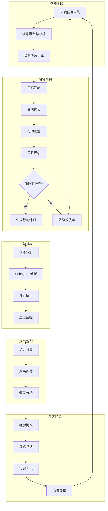
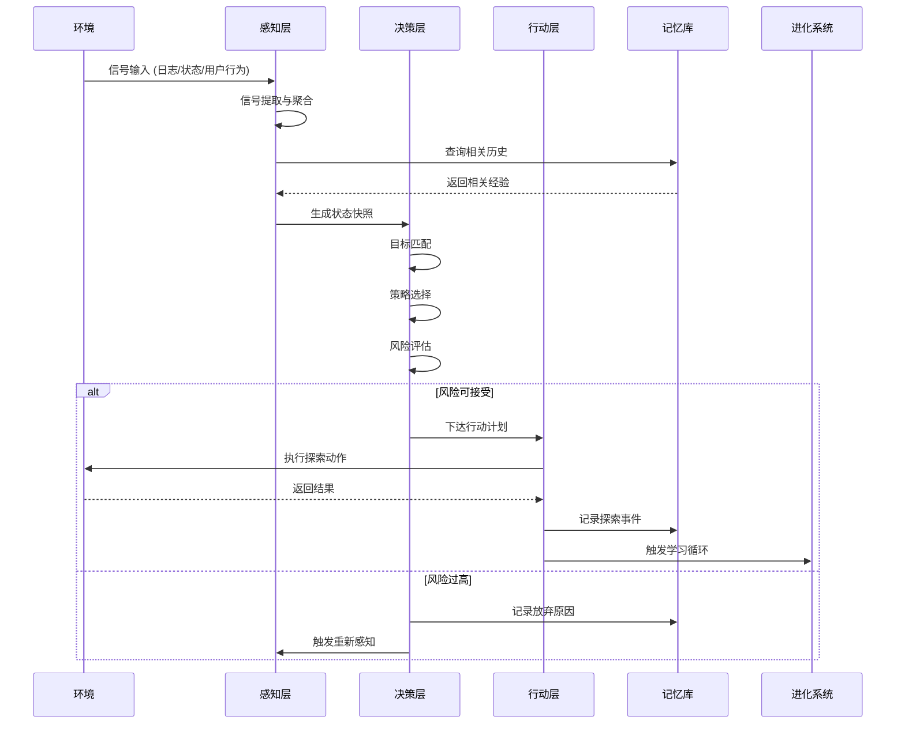

# OpenClaw 自主探索能力架构设计

> **文档版本**: v1.0  
> **作者**: 系统架构师  
> **日期**: 2026-02-23  
> **状态**: 设计草案

---

## 一、愿景定义

### 1.1 核心愿景

**让 OpenClaw 从"被动执行者"进化为"主动探索者"**

```
当前状态                          目标状态
   │                                │
   ▼                                ▼
[用户指令] → [执行任务]      [环境信号] → [主动探索] → [价值发现]
                                [用户意图] ↗              ↓
                                                    [自主行动]
                                                         ↓
                                                    [反馈学习]
```

### 1.2 成功标准

| 维度 | 指标 | 衡量方法 |
|------|------|----------|
| **主动性** | 无指令时自主产生有价值行动 | 每日主动行动中 ≥50% 被用户认可或产生实际价值 |
| **探索效率** | 发现新能力/优化点的速度 | 每周自主发现并验证 ≥3 个有效改进点 |
| **安全边界** | 不产生破坏性后果 | 严重事故率 < 0.1% (需人工干预的重大问题) |
| **学习能力** | 持续提升探索质量 | 探索成功率（行动→价值转化率）月增长 ≥10% |
| **用户信任** | 用户满意度 | 用户主动启用自主探索功能时长占比 ≥80% |

### 1.3 设计原则

1. **安全优先**：任何自主行动必须在可预测的边界内
2. **渐进式能力**：从简单探索逐步升级到复杂探索
3. **透明可控**：用户随时可查看、暂停、回滚自主行为
4. **价值导向**：所有探索必须服务于明确的目标（用户利益/系统健康）
5. **与现有系统无缝整合**：复用 Evolver、Skills、Subagent 等现有能力

---

## 二、架构设计

### 2.1 整体架构图

```
┌─────────────────────────────────────────────────────────────────────────┐
│                        OpenClaw 自主探索系统                              │
├─────────────────────────────────────────────────────────────────────────┤
│                                                                         │
│  ┌─────────────────────────────────────────────────────────────────┐   │
│  │                    探索循环引擎 (Exploration Loop)                 │   │
│  │  ┌──────────┐   ┌──────────┐   ┌──────────┐   ┌──────────┐      │   │
│  │  │  感知    │ → │  决策    │ → │  行动    │ → │  反馈    │      │   │
│  │  │ Perceive │   │  Decide  │   │   Act    │   │ Feedback │      │   │
│  │  └────┬─────┘   └────┬─────┘   └────┬─────┘   └────┬─────┘      │   │
│  │       │              │              │              │             │   │
│  │       └──────────────┴──────────────┴──────────────┘             │   │
│  │                              ↓                                   │   │
│  │                     ┌──────────────┐                             │   │
│  │                     │    学习      │                             │   │
│  │                     │    Learn     │                             │   │
│  │                     └──────────────┘                             │   │
│  └─────────────────────────────────────────────────────────────────┘   │
│                                    │                                    │
│  ┌─────────────────────────────────┼─────────────────────────────────┐ │
│  │                          核心组件层                                │ │
│  │  ┌─────────────┐ ┌─────────────┐ ┌─────────────┐ ┌─────────────┐  │ │
│  │  │ 目标管理器   │ │ 探索策略器   │ │ 风险评估器   │ │ 探索记忆库   │  │ │
│  │  │GoalManager  │ │StrategyPlanner│RiskAssessor │ │ExploreMemory│  │ │
│  │  └─────────────┘ └─────────────┘ └─────────────┘ └─────────────┘  │ │
│  └─────────────────────────────────────────────────────────────────┘   │
│                                    │                                    │
│  ┌─────────────────────────────────┼─────────────────────────────────┐ │
│  │                        整合层 (与现有系统)                          │ │
│  │  ┌─────────────┐ ┌─────────────┐ ┌─────────────┐ ┌─────────────┐  │ │
│  │  │   Evolver   │ │   Skills    │ │  Subagent   │ │  Sessions   │  │ │
│  │  │   进化系统   │ │   能力扩展   │ │  并行任务   │ │  会话管理   │  │ │
│  │  └─────────────┘ └─────────────┘ └─────────────┘ └─────────────┘  │ │
│  └─────────────────────────────────────────────────────────────────┘   │
│                                                                         │
└─────────────────────────────────────────────────────────────────────────┘
```

### 2.2 探索循环详细设计



### 2.3 核心组件设计

#### 2.3.1 目标管理器 (GoalManager)

**职责**：定义、追踪、优先级排序探索目标

```typescript
interface ExplorationGoal {
  id: string;
  type: 'user_derived' | 'system_health' | 'capability_expansion' | 'efficiency';
  priority: 'critical' | 'high' | 'medium' | 'low';
  description: string;
  success_criteria: string[];
  constraints: ExplorationConstraint[];
  status: 'pending' | 'active' | 'completed' | 'abandoned';
  created_at: Date;
  deadline?: Date;
  parent_goal_id?: string;
  derived_from?: string; // 来源：用户指令/信号/其他目标
}

interface ExplorationConstraint {
  type: 'time_budget' | 'resource_limit' | 'risk_threshold' | 'scope';
  value: any;
  strict: boolean; // 是否为硬约束
}
```

**目标来源**：
1. **用户意图推断**：从对话历史推断长期目标
2. **系统健康信号**：性能瓶颈、错误模式、资源告警
3. **能力发现**：识别未使用但可能有价值的工具/技能
4. **效率优化**：重复模式识别、自动化机会

#### 2.3.2 探索策略器 (StrategyPlanner)

**职责**：根据当前状态选择最优探索策略

```typescript
type ExplorationStrategy = 
  | 'scan'        // 扫描型：广泛收集信息，不执行变更
  | 'probe'       // 探针型：小规模试错，快速验证假设
  | 'expand'      // 扩展型：基于已知成功模式扩展
  | 'deep_dive'   // 深入型：对特定领域深入探索
  | 'maintain';   // 维护型：保持系统稳定，仅观察

interface StrategySelection {
  strategy: ExplorationStrategy;
  reasoning: string;
  expected_value: number;      // 预期价值 (0-1)
  estimated_risk: number;       // 估计风险 (0-1)
  resource_budget: ResourceBudget;
  rollback_plan: string;
}
```

**策略选择决策树**：

```
                ┌─────────────────┐
                │ 当前系统状态?    │
                └────────┬────────┘
           ┌─────────────┼─────────────┐
           ▼             ▼             ▼
      [有错误/告警]   [稳定运行]    [空闲状态]
           │             │             │
           ▼             ▼             ▼
      [scan+probe]  [expand/deep]  [scan+maintain]
           │             │             │
           ▼             ▼             ▼
      优先修复      寻找优化机会    环境感知更新
```

#### 2.3.3 风险评估器 (RiskAssessor)

**职责**：评估自主行动的潜在风险，决定是否执行

```typescript
interface RiskAssessment {
  action_id: string;
  overall_risk_level: 'safe' | 'low' | 'medium' | 'high' | 'critical';
  
  risk_dimensions: {
    data_loss: number;        // 数据丢失风险 (0-1)
    service_disruption: number; // 服务中断风险
    user_experience: number;  // 用户体验影响
    resource_consumption: number; // 资源消耗
    reversibility: number;    // 不可逆程度 (越高越危险)
  };
  
  blast_radius: {
    affected_files: string[];
    affected_services: string[];
    estimated_recovery_time: string;
  };
  
  mitigation_strategies: string[];
  approval_required: boolean;
}
```

**风险决策规则**：

| 风险等级 | 可执行条件 | 需要审批 |
|---------|-----------|---------|
| safe | 自动执行 | 否 |
| low | 自动执行，记录日志 | 否 |
| medium | 低峰期执行，预先备份 | 可选 |
| high | 需要用户确认 | 是 |
| critical | 禁止自动执行 | 强制 |

#### 2.3.4 探索记忆库 (ExploreMemory)

**职责**：存储探索历史、学习成果，支持经验复用

```typescript
interface ExplorationMemory {
  // 短期记忆：当前探索周期上下文
  short_term: {
    current_cycle: ExplorationCycle;
    recent_observations: Observation[];
    active_hypotheses: Hypothesis[];
  };
  
  // 中期记忆：近期探索成果
  medium_term: {
    successful_patterns: Pattern[];
    failed_approaches: FailedApproach[];
    lessons_learned: Lesson[];
    exploration_history: ExplorationEvent[]; // 最近 30 天
  };
  
  // 长期记忆：固化知识
  long_term: {
    // 复用现有 Evolver 的 Gene/Capsule 系统
    genes: Gene[];           // 可复用的探索模式
    capsules: Capsule[];     // 成功的探索案例
    principles: Principle[]; // 提炼的原则
  };
}
```

### 2.4 数据流设计



### 2.5 与现有架构的整合点

| 现有系统 | 整合方式 | 复用内容 |
|---------|---------|---------|
| **Evolver** | 扩展而非替换 | 复用 GEP 协议、Gene/Capsule、Memory Graph、信号系统 |
| **Skills** | 探索能力即 Skill | 将探索器实现为 `explorer` Skill |
| **Subagent** | 并行探索执行 | 多个探索任务可并行派发给 Subagent |
| **Sessions** | 探索会话隔离 | 探索行为在独立会话中执行，可追溯 |
| **Heartbeat** | 探索触发时机 | 复用心跳机制作为探索周期的触发点 |

#### 整合架构图

```
┌─────────────────────────────────────────────────────────────────┐
│                     OpenClaw 核心系统                            │
├─────────────────────────────────────────────────────────────────┤
│                                                                 │
│   ┌─────────────────────────────────────────────────────────┐  │
│   │                    Heartbeat System                      │  │
│   │                    (心跳触发器)                           │  │
│   └───────────────────────┬─────────────────────────────────┘  │
│                           │                                     │
│                           ▼                                     │
│   ┌─────────────────────────────────────────────────────────┐  │
│   │               Explorer Skill (新增)                      │  │
│   │  ┌─────────────────────────────────────────────────┐    │  │
│   │  │            探索循环引擎                           │    │  │
│   │  │                                                  │    │  │
│   │  │   感知 ←→ 决策 ←→ 行动 ←→ 反馈 ←→ 学习          │    │  │
│   │  │     ↑         ↑         ↑         ↑         ↑    │    │  │
│   │  │     │         │         │         │         │    │    │  │
│   │  │     └─────────┴─────────┴─────────┴─────────┘    │    │  │
│   │  │                      ↓                           │    │  │
│   │  └──────────────────────│───────────────────────────┘    │  │
│   └─────────────────────────┼───────────────────────────────┘  │
│                             │                                   │
│         ┌───────────────────┼───────────────────┐              │
│         ▼                   ▼                   ▼              │
│   ┌───────────┐      ┌───────────┐      ┌───────────┐         │
│   │  Evolver  │      │  Skills   │      │ Subagent  │         │
│   │  (复用)   │      │  (复用)   │      │  (复用)   │         │
│   │           │      │           │      │           │         │
│   │ • GEP协议 │      │ • 工具调用 │      │ • 并行执行 │         │
│   │ • 信号系统 │      │ • 能力扩展 │      │ • 任务派发 │         │
│   │ • Gene库  │      │           │      │           │         │
│   └───────────┘      └───────────┘      └───────────┘         │
│                                                                 │
└─────────────────────────────────────────────────────────────────┘
```

---

## 三、实现路线图

### 3.1 第一阶段：最小可行原型 (MVP) - 1-2 周

**目标**：验证核心探索循环可行性

#### 3.1.1 功能范围

```
MVP 功能边界
├── 感知
│   ├── 日志分析 (复用 Evolver)
│   ├── 系统状态检查 (复用心跳)
│   └── 基础信号提取 (3-5 种核心信号)
│
├── 决策
│   ├── 简单规则引擎 (if-then 规则)
│   ├── 固定策略选择 (scan/probe 二选一)
│   └── 基础风险评估 (白名单机制)
│
├── 行动
│   ├── 只读探索 (不执行任何变更)
│   ├── 信息收集 (web_search, web_fetch)
│   └── 报告生成 (输出发现结果)
│
└── 反馈/学习
    └── (MVP 暂不实现，仅记录)
```

#### 3.1.2 交付物

1. **Explorer Skill 骨架**
   ```
   skills/explorer/
   ├── SKILL.md           # 技能描述
   ├── index.js           # 入口
   ├── src/
   │   ├── perceive.js    # 感知模块
   │   ├── decide.js      # 决策模块
   │   ├── act.js         # 行动模块
   │   └── report.js      # 报告模块
   └── memory/
       └── exploration_log.jsonl  # 探索日志
   ```

2. **基础探索规则集**
   ```yaml
   # explorer-rules.yaml
   rules:
     - name: "scan_for_errors"
       trigger: "error_signal_detected"
       action: "analyze_logs"
       risk: "safe"
       
     - name: "check_for_updates"
       trigger: "heartbeat_24h"
       action: "check_package_updates"
       risk: "safe"
       
     - name: "discover_new_tools"
       trigger: "stable_state_7d"
       action: "scan_available_skills"
       risk: "safe"
   ```

3. **集成到心跳系统**
   - 在 `HEARTBEAT.md` 中添加探索检查项
   - 探索结果写入 `memory/exploration/YYYY-MM-DD.md`

#### 3.1.3 成功标准

- [ ] 系统能够自动识别 3 种以上信号类型
- [ ] 每日自动产生至少 1 条有价值的探索报告
- [ ] 不会执行任何变更性操作（只读验证）
- [ ] 用户可随时禁用自主探索功能

### 3.2 第二阶段：核心功能实现 - 1 个月

**目标**：实现完整的探索循环 + 基础学习能力

#### 3.2.1 功能扩展

```
第二阶段功能
├── 感知 (增强)
│   ├── 多源信号融合 (日志 + 监控 + 用户行为)
│   ├── 时序分析 (识别趋势和模式)
│   └── 异常检测 (偏离基线的行为)
│
├── 决策 (增强)
│   ├── 目标管理器 (支持多目标追踪)
│   ├── 策略动态选择 (基于历史成功率)
│   └── 风险量化评估 (评分模型)
│
├── 行动 (增强)
│   ├── 低风险自动执行 (白名单内操作)
│   ├── Subagent 并行探索
│   └── 探索任务队列
│
└── 反馈/学习 (新增)
    ├── 效果评估 (行动结果 vs 预期)
    ├── 经验提取 (成功/失败模式)
    └── 与 Evolver 整合 (复用 Gene/Capsule)
```

#### 3.2.2 交付物

1. **完整探索循环引擎**
   - `ExplorerLoop` 类，支持暂停/恢复
   - 可配置的探索周期和深度

2. **风险评估器**
   ```typescript
   class RiskAssessor {
     assess(action: ExplorationAction): RiskAssessment;
     canAutoExecute(risk: RiskAssessment): boolean;
     getMitigationPlan(risk: RiskAssessment): MitigationPlan;
   }
   ```

3. **探索记忆库**
   - 短期记忆：Redis/内存
   - 中期记忆：文件系统 JSON
   - 长期记忆：与 Evolver Gene/Capsule 共享

4. **Subagent 探索任务模板**
   ```
   explore_task_template = {
     "task_type": "probe",
     "target": "skill_capability",
     "constraints": {
       "read_only": true,
       "max_duration": "5m",
       "report_on_complete": true
     }
   }
   ```

#### 3.2.3 成功标准

- [ ] 探索循环能够持续运行 >72 小时无人工干预
- [ ] 每周自主发现并验证 ≥3 个有效改进点
- [ ] 风险评估准确率 ≥80%（无严重误判）
- [ ] 探索结果中 ≥30% 被用户认为有价值

### 3.3 第三阶段：持续优化 - 长期

**目标**：打造自适应、高效率的探索系统

#### 3.3.1 功能演进

```
第三阶段功能
├── 高级感知
│   ├── 预测性信号 (提前发现问题)
│   ├── 用户意图深层理解
│   └── 跨会话上下文关联
│
├── 智能决策
│   ├── 强化学习策略优化
│   ├── 多目标权衡决策
│   └── 不确定性推理
│
├── 自主行动
│   ├── 受信任的变更执行
│   ├── 自我修复能力
│   └── 主动能力扩展
│
└── 深度学习
    ├── 探索策略自优化
    ├── 成功模式泛化
    └── 失败预警模型
```

#### 3.3.2 关键里程碑

| 里程碑 | 预计时间 | 描述 |
|--------|---------|------|
| **M1: 自稳定** | +1 月 | 系统能够自主发现并修复常见问题 |
| **M2: 自扩展** | +2 月 | 系统能够自主发现并安装有价值的新技能 |
| **M3: 自优化** | +3 月 | 探索策略能够根据环境自动调整 |
| **M4: 自进化** | +6 月 | 与 Evolver 深度整合，实现能力自主进化 |

---

## 四、安全设计

### 4.1 安全边界

```
┌─────────────────────────────────────────────────────────────┐
│                    安全沙箱边界                              │
│  ┌─────────────────────────────────────────────────────┐   │
│  │                 允许自动执行                          │   │
│  │  • 只读操作 (read, web_search, web_fetch)           │   │
│  │  • 日志分析                                          │   │
│  │  • 报告生成                                          │   │
│  │  • 低风险配置调整 (白名单内)                          │   │
│  │  • 技能发现和评估 (不安装)                            │   │
│  └─────────────────────────────────────────────────────┘   │
│                                                             │
│  ┌─────────────────────────────────────────────────────┐   │
│  │                需要用户确认                           │   │
│  │  • 代码变更                                          │   │
│  │  • 配置修改                                          │   │
│  │  • 安装新技能                                        │   │
│  │  • 外部通信 (发送消息/邮件)                           │   │
│  │  • 文件删除                                          │   │
│  └─────────────────────────────────────────────────────┘   │
│                                                             │
│  ┌─────────────────────────────────────────────────────┐   │
│  │                  禁止自动执行                         │   │
│  │  • 系统命令执行 (exec 高风险命令)                     │   │
│  │  • 生产环境变更                                      │   │
│  │  • 敏感数据访问                                      │   │
│  │  • 修改自身安全规则                                  │   │
│  └─────────────────────────────────────────────────────┘   │
└─────────────────────────────────────────────────────────────┘
```

### 4.2 紧急停止机制

```yaml
emergency_stop:
  triggers:
    - error_rate_spike: "> 5 errors in 5 minutes"
    - resource_exhaustion: "memory > 90% or cpu > 95%"
    - user_command: "STOP EXPLORATION"
    - unexpected_behavior: "action_result != expected_result for 3 consecutive times"
  
  actions:
    - halt_all_exploration_loops
    - preserve_current_state
    - notify_user
    - enter_safe_mode (只读观察)
  
  recovery:
    - user_explicit_approval_required: true
    - root_cause_analysis: automatic
    - rollback_capability: enabled
```

### 4.3 审计追踪

所有自主探索行为记录在：

```
memory/exploration/
├── events.jsonl          # 探索事件流 (append-only)
├── decisions.jsonl       # 决策日志
├── actions.jsonl         # 行动日志
└── outcomes.jsonl        # 结果日志
```

日志格式：
```json
{
  "event_id": "exp_20260223_001",
  "timestamp": "2026-02-23T12:00:00Z",
  "cycle_id": "cycle_001",
  "phase": "act",
  "action_type": "web_search",
  "action_params": {"query": "latest AI agent frameworks"},
  "risk_level": "safe",
  "reasoning": "Discover new capabilities for skill expansion",
  "result_summary": "Found 3 relevant frameworks",
  "user_feedback": null,
  "auto_approved": true
}
```

---

## 五、配置接口

### 5.1 用户可配置项

```json
// openclaw.json
{
  "explorer": {
    "enabled": true,
    "mode": "conservative",  // conservative | balanced | aggressive
    "schedule": {
      "heartbeat_integration": true,
      "min_interval_minutes": 30,
      "quiet_hours": ["23:00-08:00"]
    },
    "constraints": {
      "max_concurrent_explorations": 3,
      "max_duration_per_cycle": "10m",
      "require_approval_for": ["code_changes", "external_comm"]
    },
    "learning": {
      "enabled": true,
      "share_with_evolver": true
    }
  }
}
```

### 5.2 模式说明

| 模式 | 行为特点 | 适用场景 |
|------|---------|---------|
| **conservative** | 只读探索，不执行任何变更 | 初期信任建立、生产环境 |
| **balanced** | 低风险自动执行，中高风险需确认 | 日常使用 |
| **aggressive** | 中风险自动执行，仅高风险需确认 | 开发环境、实验阶段 |

---

## 六、总结

### 6.1 设计亮点

1. **渐进式能力**：从只读观察逐步升级到自主行动
2. **复用现有系统**：最大化利用 Evolver、Skills、Subagent 等成熟组件
3. **安全可控**：多层安全边界 + 完整审计追踪
4. **可观测性**：用户随时了解系统在做什么、为什么做
5. **学习进化**：探索成果固化为可复用知识

### 6.2 下一步行动

1. **Week 1**：搭建 Explorer Skill 骨架，实现基础感知模块
2. **Week 2**：完成 MVP，在测试环境验证只读探索循环
3. **Week 3-4**：增强决策和行动能力，实现低风险自动执行
4. **Week 5-8**：完成学习模块，与 Evolver 深度整合

### 6.3 风险与缓解

| 风险 | 影响 | 缓解措施 |
|------|------|---------|
| 过度自主导致意外后果 | 高 | 分层审批机制 + 紧急停止 |
| 探索效率低下 | 中 | 策略优化 + 历史学习 |
| 资源消耗过大 | 中 | 资源预算限制 + 低峰期执行 |
| 用户信任不足 | 高 | 透明报告 + 渐进式启用 |

---

> **文档结束**  
> 反馈请提交至项目 Issue 或直接联系架构团队
